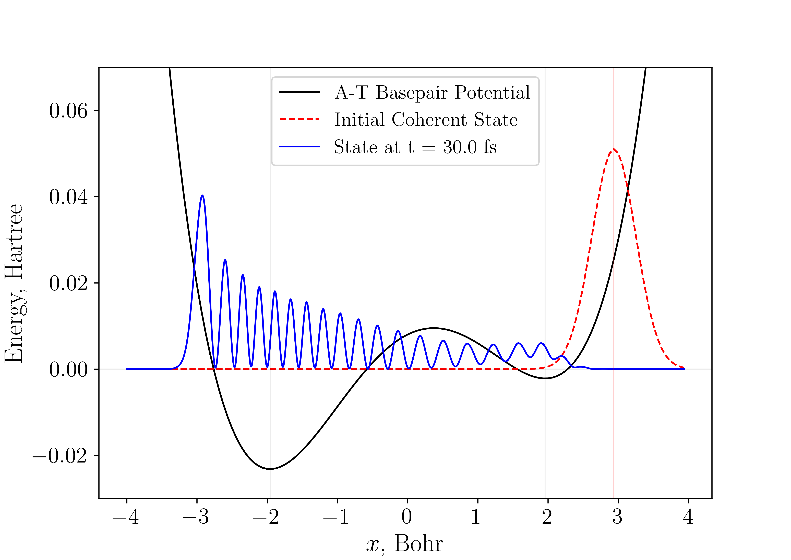

# **Simulation of Proton Transfer Dynamics in Adenine-Thymine Base Pair**

In this section, we will compute the dynamics for the proton transfer in an Adenine-Thymine Base Pair!


## Setting Up The Simulation

We have included the Adenine-Thymine base pair potential as a default quartic potential in `qflux`. It can be implemented with the following code: 

```python

from qflux.closed_systems.utils import get_proton_mass
from qflux.closed_systems import DynamicsCS

x0 = 1.9592 # x_0 scaling factor
omega = 0.00436 # frequency corresponding to right well from V''(x)
proton_mass = get_proton_mass() # Proton mass in a.u.

# Instantiate our class with 128 grid points, initial displacement, mass of proton, and frequency
dw_dyn_obj = DynamicsCS(n_basis=128, xo=1.5*x0, mass=proton_mass, omega=omega)

# Define our coordinate grid range
dw_dyn_obj.set_coordinate_operators(x_min=-4.0, x_max=4.0)
# Initialize operators
dw_dyn_obj.initialize_operators()
# Construct initial state
dw_dyn_obj.set_initial_state(wfn_omega=omega)

# Define the propagation time
total_time = convert_fs_to_au(30.0)
N_steps = 3000
dw_dyn_obj.set_propagation_time(total_time, N_steps)

# Set our hamiltonian as a quartic potential
dw_dyn_obj.set_hamiltonian(potential_type='quartic')
# Propagate
dw_dyn_obj.propagate_SOFT()
dw_dyn_obj.propagate_qt()
```

We can check the initial state by plotting on the potential: 

```python 
import matplotlib.pyplot as plt
fig, ax = plt.subplots()
ax.plot(dw_dyn_obj.x_grid, dw_dyn_obj._PE_grid + 0.008 , '-', color='black', label='A-T Basepair Potential')
ax.plot(dw_dyn_obj.x_grid, np.real(0.04*dw_dyn_obj.psio_grid.conj()*dw_dyn_obj.psio_grid), '--', color='red', label='Initial Coherent State')
ax.axhline(0, lw=0.5, color='black', alpha=1.0)
ax.axvline(-dw_dyn_obj.x0, lw=0.5, color='black', alpha=0.5)
ax.axvline(dw_dyn_obj.x0, lw=0.5, color='black', alpha=0.5)
ax.axvline(dw_dyn_obj.x0*1.5, lw=0.5, color='red', alpha=0.5)
ax.set_xlabel('x, Bohr',fontsize=18)
ax.set_ylabel('Energy, Hartree',fontsize=18)We i
ax.tick_params(labelsize=16, grid_alpha=0.5)
plt.ylim(-0.03,0.07)
plt.legend(fontsize=14,loc='upper center')
```

Which should produce a plot like this: 


And we can also visualize with the final propagated state: 

```python

from scipy.interpolate import interp1d
import numpy as np 

x_1024 = np.linspace(dw_dyn_obj.x_grid[0], dw_dyn_obj.x_grid[-1], 1024)
f_interp = interp1d(dw_dyn_obj.x_grid, dw_dyn_obj.dynamics_results_grid[-1], kind='cubic')
rho_interp = f_interp(x_1024)

fig, ax = plt.subplots()
ax.plot(dw_dyn_obj.x_grid, dw_dyn_obj._PE_grid + 0.008, '-',color='black',label='A-T Basepair Potential')
ax.plot(dw_dyn_obj.x_grid, 0.04*np.real(dw_dyn_obj.psio_grid.conj()*dw_dyn_obj.psio_grid),'--',color='red',label='Initial Coherent State')
ax.plot(x_1024, 0.04*np.real(rho_interp.conj()*rho_interp),'-',color='blue',label=f'State at t = {convert_au_to_fs(total_time)} fs')
ax.axhline(0, lw=0.5, color='black', alpha=1.0)
ax.axvline(-x0, lw=0.5, color='black', alpha=0.5)
ax.axvline(x0, lw=0.5, color='black', alpha=0.5)
ax.axvline(x0*1.5, lw=0.5, color='red', alpha=0.5)
ax.set_xlabel('$x$, Bohr',fontsize=18)
ax.set_ylabel('Energy, Hartree',fontsize=18)
ax.tick_params(labelsize=16, grid_alpha=0.5)
plt.ylim(-0.03,0.07)
plt.legend(fontsize=14,loc='upper center')
```



And we can also look at the expectation value of the position as a function of time: 

```python
from qflux.closed_systems.utils import calculate_expectation_values, convert_au_to_fs

avxgrid = calculate_expectation_values(dw_dyn_obj.dynamics_results_grid, dw_dyn_obj.x_grid)
fig, ax = plt.subplots()
ax.plot(dw_dyn_obj.tlist*convert_au_to_fs(1.), avxgrid, '-', color='blue',label=r'SOFT')
ax.axhline(-x0, ls='--', lw=0.5, color='black', alpha=0.5)
ax.axhline( x0, ls='--', lw=0.5, color='black', alpha=0.5)
plt.text(20, x0-0.1, 'Reactant Well', fontsize = 16, backgroundcolor='white')
plt.text(5, -x0-0.1, 'Product Well', fontsize = 16, backgroundcolor='white')
ax.set_xlabel(r'Time, fs')
ax.set_ylabel(r'$\left\langle x \right\rangle$, Bohr')
ax.tick_params(grid_alpha=0.5)
plt.ylim(-3,4)
plt.legend(loc='upper right')
```


