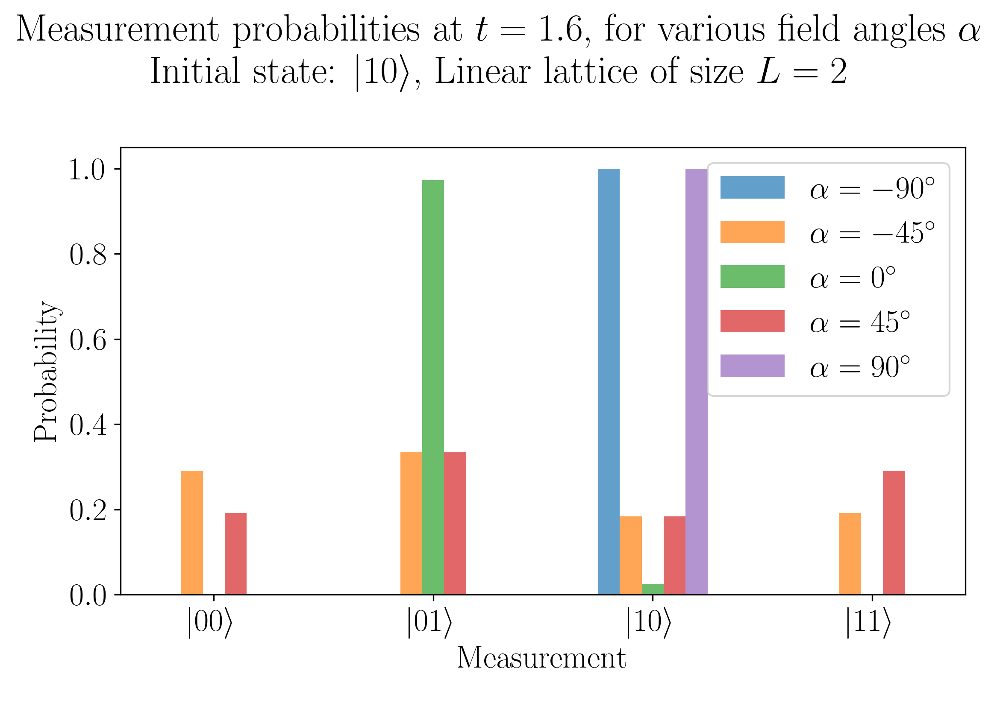
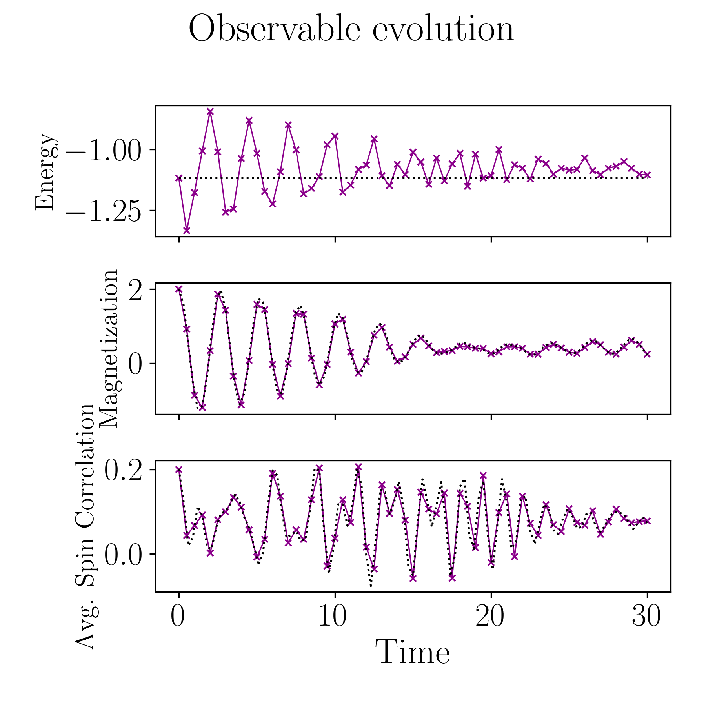
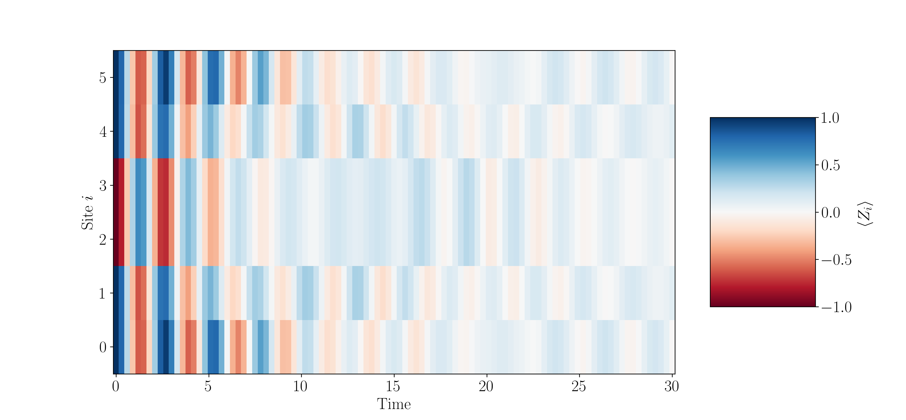
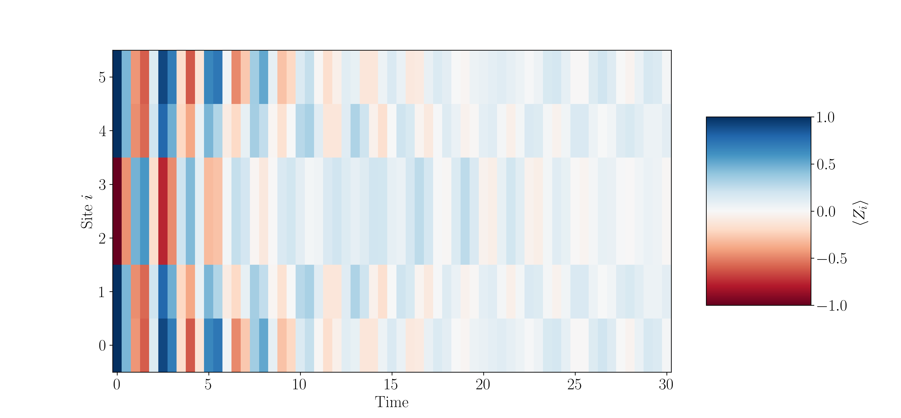

# Evolution for an Arbitrary Hamiltonian

## Background

Let us now consider the task of running quantum dynamics for an arbitrary Hamiltonian describing a system of interest, $\hat{H}$. To do this on a quantum device, we must first express the Hamiltonian in a way that can be easily understood by the quantum device, that is to say that we must express the Hamiltonian as a series of native quantum gates. We can do this by expressing the Hamiltonian as a weighted combination of Pauli strings: 

$$ \hat{H}_{\text{Pauli}} = \sum_{i} \alpha_{i} P_{i} $$ 

where $P_{i}$ is an $n$-qubit Pauli string corresponding to Pauli gates acting on an $n$-qubit quantum register. 

This task can be completed via the `decompose()` utility function in `qflux`. 

Once we've rewritten our Hamiltonian, we can implement real-time dynamics on the quantum device by representing the propagator as a quantum circuit: 

$$ \hat{U} = e^{- \frac{i}{\hbar} \hat{H}_{\text{Pauli}} \tau} $$ 

where $\tau$ is the time-step. By applying the propagator to a quantum register initialized to our initial state for dynamics calculation ($\left| \psi_{0} \right\rangle$), we can obtain the time-evolved state $\left| \psi ( t ) \right\rangle$. 

## Example: Ising Model

In the following example, we follow [this example](https://qiskit-community.github.io/qiskit-algorithms/tutorials/13_trotterQRTE.html) and look at the time evolution of an Ising Model on linear lattices of length $L$ consisting of an array of spins $\sigma_{i}^{z}$ with nearest-neighbor interactions. These spins can have two orientations: $\uparrow$ and $\downarrow$, which corresopnd to a magnetization of +1 and -1. 

The Hamiltonian for this sort of system can be written as: 

$$ H = - J \sum_{i=0}^{L-2} \sigma_{i} \sigma_{i+1} - h \sum_{i=0}^{L-1} \sigma_{i} $$ 

where $J$ describes the interaction energy between neighboring spins and $h$ describes the magnitude of an applied field. We can write this in terms of Pauli matrix and take the angle (with respect to the trasnversal direction) of the applied field into account: 

$$ H = - J \sum_{i=0}^{L-2} Z_{i} Z_{i+1} - h \sum_{i=0}^{L-1} \left( \sin(\alpha) Z_{i} + \cos(\alpha) X_{i} \right) $$ 

We can write a Python function to construct this Hamiltonian: 

```python
from qiskit.quantum_info import SparsePauliOp
from math import sin, cos, pi

def get_hamiltonian(L: int, J: float, h: float, alpha: float):
    r'''
    Function to construct the Ising Model Hamiltonian for a linear chain 
    of length L with nearest-neighbor interactions, subject to an external
    field applied at an angle $\alpha$ with respect to the transversal direction.
    
    '''
    # Construct the Hamiltonian by creating 3-tuples with:
    # (1) the Pauli string
    # (2) the qubit indices corresponding to the Pauli string
    # (3) the coefficient
    pauli_tuples = []
    for ii in range(L-1):
        pauli_tuples.append(("ZZ", [ii, ii+1], -J))
        pauli_tuples.append(("Z", [ii], -h * sin(alpha)))
        pauli_tuples.append(("X", [ii], -h * cos(alpha)))
    pauli_tuples.append(("Z", [L-1], -h * sin(alpha)))
    pauli_tuples.append(("X", [L-1], -h * cos(alpha)))
    # Construct the Hamiltonian as a SparsePauliOp from our sparse list
    hamiltonian = SparsePauliOp.from_sparse_list(pauli_tuples, num_qubits=L)
    return(hamiltonian.simplify())

```

We first look at a spin chain with two spins: 

```python
spin_H = get_hamiltonian(L=2, J=0.2, h=1.0, alpha=pi/8.)
```

And we can now construct an initial state: 

```python
from qiskit.quantum_info import Statevector
# Create an initial state with the first spin-up and the second spin-down
intial_state = Statevector.from_label("10")
```

Now we can create our dynamics object with `qflux` and compute the propagation:

```python
from qflux.closed_systems import QubitDynamicsCS
spin_dyn_obj = QubitDynamicsCS(n_basis=4)

# Specify propagation time:
total_time = 1.6
N_steps    = 1

spin_dyn_obj.set_propagation_time(total_time, N_steps)

# Set the backend
from qiskit_aer import Aer
backend = Aer.get_backend('statevector_simulator')
spin_dyn_obj.propagate_qmatvec(backend=backend, n_shots=1024, 
                               hamiltonian_matrix=spin_H.to_matrix(), 
                               initial_state=initial_state.data)
```

## Visualizing Measurement Probabilities

Now we can use this workflow to look at measurement probabilities at a series of angles for the applied external field: 

```python 
import numpy as np
import matplotlib.pyplot as plt

bar_width = 0.1
# We prepare an initial state ↑↓ (01).
# Note that Statevector and SparsePauliOp interpret the qubits from right to left
initial_state = Statevector.from_label("10")
final_time = 1.6
eps = 1e-5

# We create the list of angles in radians, with a small epsilon
# the exactly longitudinal field, which would present no dynamics at all
alphas = np.linspace(-np.pi / 2 + eps, np.pi / 2 - eps, 5)
labels = [r'$\left| 00 \right\rangle$', r'$\left| 01 \right\rangle$',
          r'$\left| 10 \right\rangle$', r'$\left| 11 \right\rangle$']

for i, alpha in enumerate(alphas):
    H_alpha = get_hamiltonian(L=2, J=0.2, h=1.0, alpha=alpha)
    spin_dyn_obj.propagate_qmatvec(backend=backend, n_shots=2048,
                                   hamiltonian_matrix=H_alpha.to_matrix(),
                                   initial_state=initial_state.data)

    evolved_state = Statevector(spin_dyn_obj.dynamics_results_qubit[-1])
    # Dictionary of probabilities
    amplitudes_dict = evolved_state.probabilities_dict()

    values = list(amplitudes_dict.values())
    # Convert angle to degrees
    alpha_str = f"$\\alpha={int(np.round(alpha * 180 / pi))}^\\circ$"
    plt.bar(np.arange(4) + i * bar_width, values, bar_width, label=alpha_str, alpha=0.7)

plt.xticks(np.arange(4) + 2 * bar_width, labels)
plt.xlabel("Measurement")
plt.ylabel("Probability")
plt.suptitle(
    f"Measurement probabilities at $t={final_time}$, for various field angles $\\alpha$\n"
    r"Initial state: $\left| 1 0 \right\rangle$, Linear lattice of size $L=2$"
)
plt.legend()
plt.tight_layout()
```

Which gives us the following plot: 

<figure markdown="span">
{: width="800"}
</figure>

## Observables

In this example, we will look at computing observables with the output of a dynamics calculation for a longer chain of spins. We begin with the calculation of the Hamiltonian: 

```python
L = 6
spin_H = get_hamiltonian(L=L, J=0.2, h=1.2, alpha=pi/8.)
```

And we proceed just as we did before with the construction of our construction object: 

```python
# Instantiate our Dynamics Object 
spin_dyn_obj = QubitDynamicsCS(n_basis=2**L)

# Specify Propagation Time
total_time    = 30.0
num_timesteps = 60
spin_dyn_obj.set_propagation_time(total_time, num_timesteps)

# Set initial State: 
initial_state = Statevector.from_label("001100")

# Set the backend
from qiskit_aer import Aer
backend = Aer.get_backend('statevector_simulator')
spin_dyn_obj.propagate_qmatvec(backend=backend, n_shots=1024, 
                               hamiltonian_matrix=spin_H.to_matrix(), 
                               initial_state=initial_state.data)
```

For our observables, we can construct a magnetization operator $\sum_{i} Z_{i}$ and a mean spin correlation operator $\sum_{i} Z_{i} Z_{i+1} / (L-1)$: 

```python
magnetization_op = SparsePauliOp.from_sparse_list(
    [("Z", [i], 1.0) for i in range(0, L)], num_qubits=L
)
correlation_op = SparsePauliOp.from_sparse_list(
    [("ZZ", [i, i + 1], 1.0) for i in range(0, L - 1)], num_qubits=L
) / (L - 1)
```

And we define a function for calculating the expectation values: 

```python
def calculate_expectation_value(dynamics_results, observable):
    expect_out = []
    
    if type(observable) != np.ndarray:
        observable = observable.to_matrix()
        
    for ii in range(len(dynamics_results)):
        expect_out.append((dynamics_results[ii].conj().T @ observable).dot(dynamics_results[ii]))
    return(np.asarray(expect_out))
```

which we can use to calculate the expectation values: 

```python
expectation_magnetization = calculate_expectation_value(spin_dyn_obj.dynamics_results_qubit, magnetization_op)
expectation_spinspin_corr = calculate_expectation_value(spin_dyn_obj.dynamics_results_qubit, correlation_op)
expectation_energy        = calculate_expectation_value(spin_dyn_obj.dynamics_results_qubit, spin_H)
```

We can compare this to the exact evolution computed as follows: 

```python
import scipy

H_array = spin_H.to_matrix()

# We define a slightly denser time mesh
exact_times = np.linspace(0, total_time, 101)

# We compute the exact evolution using the exp
exact_evolution = [scipy.linalg.expm(-1j * time * H_array) @ initial_state.data for time in exact_times]
```

And we compute the expectation values: 

```python
exact_energy        = calculate_expectation_value(exact_evolution, H_array)
exact_magnetization = calculate_expectation_value(exact_evolution, magnetization_op)
exact_correlation   = calculate_expectation_value(exact_evolution, correlation_op)
```

And plot the results of the dynamics computed with `qflux` and `scipy` for comparison: 

```python 
fig, axes = plt.subplots(3, sharex=True, figsize=(6, 6))
times = np.linspace(0, total_time, num_timesteps + 1)  # includes initial state
axes[0].plot(spin_dyn_obj.tlist, expectation_energy, label='Pauli Trotter',
             marker="x", c="darkmagenta", ls="-", lw=0.8)
axes[1].plot(spin_dyn_obj.tlist, expectation_magnetization, label='Pauli Trotter',
             marker="x", c="darkmagenta", ls="-", lw=0.8)
axes[2].plot(spin_dyn_obj.tlist, expectation_spinspin_corr, label='Pauli Trotter',
             marker="x", c="darkmagenta", ls="-", lw=0.8)
axes[0].set_ylabel("Energy", fontsize=16)
axes[1].set_ylabel("Magnetization", fontsize=16)
axes[2].set_ylabel("Avg. Spin Correlation", fontsize=16)
axes[2].set_xlabel("Time")


axes[0].plot(exact_times, exact_energy, c="k", ls=":", label="Exact")
axes[1].plot(exact_times, exact_magnetization, c="k", ls=":", label="Exact")
axes[2].plot(exact_times, exact_correlation, c="k", ls=":", label="Exact")
# Select the labels of only the first axis
legend = fig.legend(
    *axes[0].get_legend_handles_labels(),
    bbox_to_anchor=(1.0, 0.5),
    loc="center left",
    framealpha=0.5, ncols=2
)
fig.suptitle("Observable evolution")
fig.tight_layout()
```

which should look like the following: 

<figure markdown="span">
{: width="800"}
</figure>

We can also compute the site-specific magnetization: 

```python
site_specific_magnetizations = np.real(
                                    [[Statevector(tmp_state).expectation_value(term) for term in magnetization_op]
                                     for tmp_state in exact_evolution]
                                        )
```

And plot it: 

```python
from matplotlib import cm

plt.figure(figsize=(14, 2))
# Create the 2-dim xx and yy arrays tiling the grid with the x and y values
xx, yy = np.meshgrid(exact_times, np.arange(L))
plt.pcolor(xx, yy, site_specific_magnetizations.T, vmin=-1, vmax=+1, cmap="RdBu")
# Force the figure to have all y ticks from 0 to 5
plt.yticks(np.arange(L))
plt.ylabel("Site $i$")
plt.xlabel("Time")
plt.colorbar(label="$\\langle Z_i \\rangle$", aspect=1.8)
```

<figure markdown="span">
{: width="800"}
</figure>

Similarly, we can compute the site-specific magnetization with our dynamics results: 

```python
site_specific_magnetizations = np.real(
                                    [[Statevector(tmp_state).expectation_value(term) for term in magnetization_op] 
                                     for tmp_state in spin_dyn_obj.dynamics_results_qubit]
                                        )
```

And plot it just as we did for the exact dynamics result: 

```python 
from matplotlib import cm

plt.figure(figsize=(14, 2))
# Create the 2-dim xx and yy arrays tiling the grid with the x and y values
xx, yy = np.meshgrid(spin_dyn_obj.tlist, np.arange(L))
plt.pcolor(xx, yy, site_specific_magnetizations.T, vmin=-1, vmax=+1, cmap="RdBu")
# Force the figure to have all y ticks from 0 to 5
plt.yticks(np.arange(L))
plt.ylabel("Site $i$")
plt.xlabel("Time")
plt.colorbar(label="$\\langle Z_i \\rangle$", aspect=1.8)
```

<figure markdown="span">
{: width="800"}
</figure>

