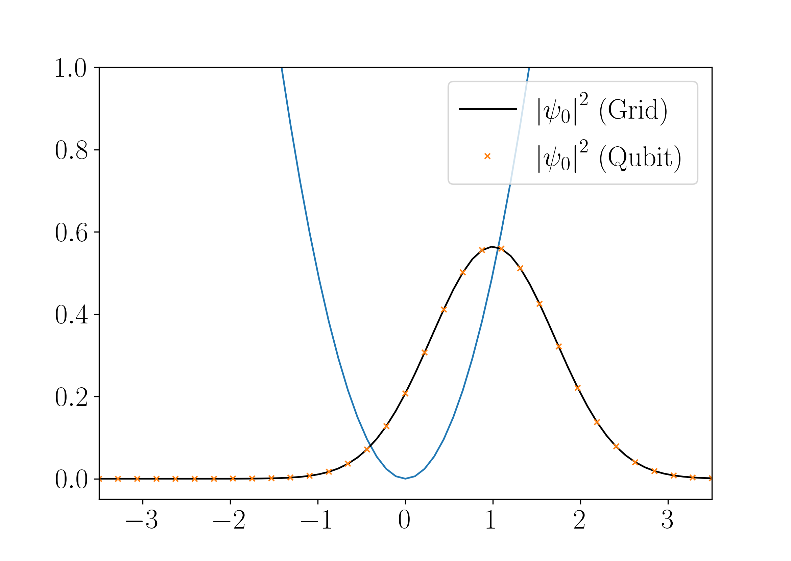
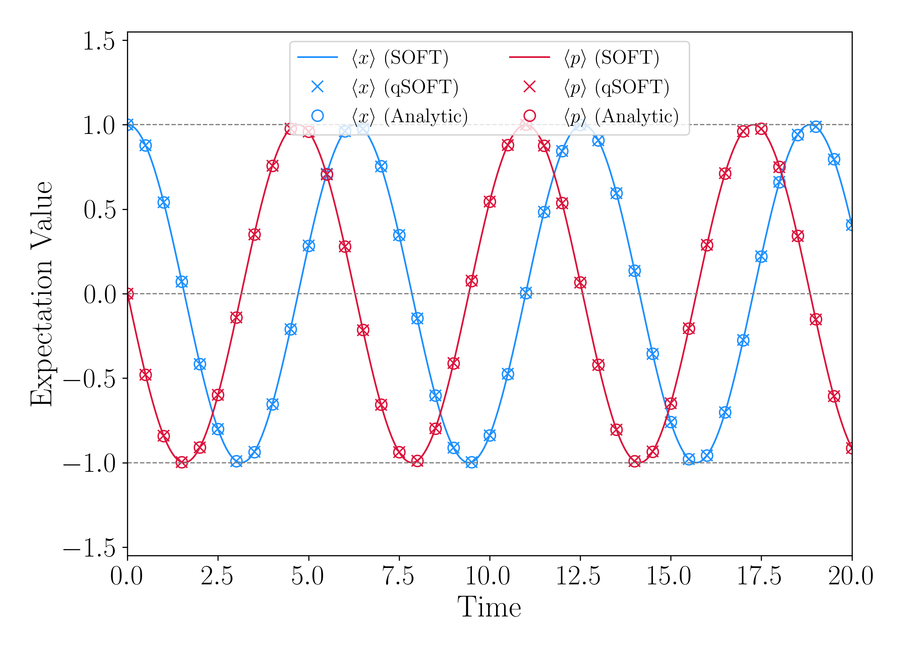
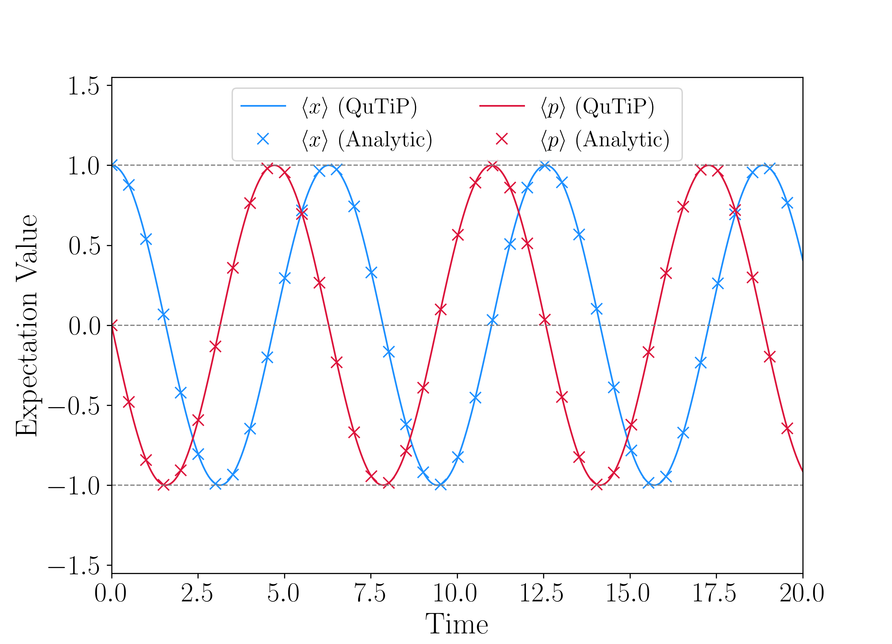

# **Your first simulation: The Quantum Harmonic Oscillator**

In this guided tutorial, we will look at the closed-system quantum dynamics of a coherent state in a harmonic potential as implemented with `qflux`.

We will first show how to compute the dynamics in the qubit-basis, illustrating the approach for running a quantum dynamics simulation on a qubit-based quantum device. Then, we will look at two classical implementations for computing the dynamics, as a means of validating our results.

## Propagation in the Qubit Basis

We begin by importing the necessary utilities from `qflux`:

```python
import sys
from qflux.closed_systems import DynamicsCS, QubitDynamicsCS
```

Now, we can instantiate our QubitDynamics object:

```python
HO_dyn_obj = QubitDynamicsCS(n_basis=128, xo=1.0, po=0.0, mass=1.0, omega=1.0)
```

Now that we have our dynamics object, we must define our discretized coordinate space and initialize our coordinate operators:

```python
HO_dyn_obj.set_coordinate_operators(x_min=-7.0, x_max=7.0, reorder_p=True)
HO_dyn_obj.initialize_operators()
```

Now that we've defined a grid for our simulation, we can construct our initial coherent state:

```python
HO_dyn_obj.set_initial_state(wfn_omega=1.0)
```

And we can define our harmonic oscillator hamiltonian (built-in to `qflux`):

```python
HO_dyn_obj.set_hamiltonian(potential_type='harmonic')
```

Now that we have defined our system parameters and initial state, we should define a propagation time. In the following, we propagate for a total time of 20.0 a.u., divided into 400 evenly spaced steps.

```python
total_time = 20.0
N_steps    = 400
HO_dyn_obj.set_propagation_time(total_time, N_steps)
```

Now we are ready to propagate!

## Propagation with Statevector Simulator

Here we demonstrate how to compute the dynamics according to the qubit-SOFT method with `qiskit`'s `statevector_simulator` backend:

```python
# Now we must set the backend prior to calling propagate qSOFT
from qiskit_aer import Aer
backend = Aer.get_backend('statevector_simulator')
HO_dyn_obj.propagate_qSOFT(backend=backend, n_shots=1024)
```

Note: the `propagate_qSOFT` method does the following things under the hood:
- Construction of the quantum circuit
- Arbitrary state initialization from our grid-based coherent state
- Conversion of the unitary operators from the SOFT method (see the section below for details) into Pauli gates
- Application of the Quantum Fourier Transform and inverse Quantum Fourier Transform for conversion between position and momentum space
- Collection of the state at each time-step of the dynamics

### Analyzing the Results

The first thing we can do is to check the state initialization in the quantum circuit formalism. To do this, we can plot initial state in the qubit basis and compare to the state in the coordinate basis:

**NOTE:** To obtain agreement between wavefunction/amplitude plots obtained in the grid-based and qubit formalisms, one must carefully account for the grid-spacing with qubit-based objects.For all qubit-formalism state objects, `qflux` adheres to the norm required by `qiskit`: $\psi^{*} \cdot \psi = 1$, while the grid-based states will follow a more familiar normalization $\int \psi^{*} \psi \, dx = 1$.

```python
import matplotlib.pyplot as plt
import numpy as np

plt.figure()
plt.plot(HO_dyn_obj.x_grid, HO_dyn_obj._PE_grid)
plt.plot(HO_dyn_obj.x_grid,
         np.real(HO_dyn_obj.psio_grid.conj() * HO_dyn_obj.psio_grid),
         color='k', label=r'$\left| \psi_{0} \right|^{2}$ (Grid)')
plt.plot(HO_dyn_obj.x_grid,
         np.real(HO_dyn_obj.dynamics_results_qubit[0].conj() *
                 HO_dyn_obj.dynamics_results_qubit[0])/HO_dyn_obj.dx,
         marker='x', lw=0, markevery=2, label=r'$\left| \psi_{0} \right|^{2}$ (Qubit)')
plt.ylim(-.05, 1.0)
plt.legend()
plt.xlim(-3.5, 3.5)
plt.xlabel(r'$x$')
plt.tight_layout()
```
<figure markdown="span">
{: width="800" }
</figure>

To compare the dynamics, we can calculate and plot the expectation value over time for the qSOFT and SOFT results with the analytical expressions:

```python
import numpy as np
from qflux.closed_systems.utils import calculate_expectation_values

qubit_exp_x_soft = calculate_expectation_values(HO_dyn_obj.dynamics_results_qubit, HO_dyn_obj.x_grid, dx=1)
grid_exp_x_soft = calculate_expectation_values(HO_dyn_obj.dynamics_results_grid, HO_dyn_obj.x_grid)

qubit_exp_p_soft = calculate_expectation_values(HO_dyn_obj.dynamics_results_qubit, HO_dyn_obj.p_grid, dx=1., do_FFT=True)
grid_exp_p_soft = calculate_expectation_values(HO_dyn_obj.dynamics_results_grid, HO_dyn_obj.p_grid, dx=HO_dyn_obj.dx, do_FFT=True)

exp_x_ana = HO_dyn_obj.xo*np.cos(HO_dyn_obj.omega*HO_dyn_obj.tlist) + (HO_dyn_obj.po/HO_dyn_obj.mass/HO_dyn_obj.omega)*np.sin(HO_dyn_obj.omega*HO_dyn_obj.tlist)
exp_p_ana = HO_dyn_obj.po*np.cos(HO_dyn_obj.omega*HO_dyn_obj.tlist) - HO_dyn_obj.xo*HO_dyn_obj.omega*HO_dyn_obj.mass*np.sin(HO_dyn_obj.omega*HO_dyn_obj.tlist)

# Plot expectation value, compare to analytic expression
plt.figure(figsize=(9, 6.5))
plt.plot(HO_dyn_obj.tlist, grid_exp_x_soft, label=r'$\left\langle x \right\rangle$ (SOFT)', color='dodgerblue')
plt.plot(HO_dyn_obj.tlist, qubit_exp_x_soft, label=r'$\left\langle x \right\rangle$ (qSOFT)',
         lw=0, marker='x', markevery=10, color='dodgerblue', ms=8, zorder=1)
plt.plot(HO_dyn_obj.tlist, exp_x_ana, label=r'$\left\langle x \right\rangle$ (Analytic)',
         lw=0, marker='o', markevery=10, color='dodgerblue', ms=8, fillstyle='none')
plt.plot(HO_dyn_obj.tlist, grid_exp_p_soft, label=r'$\left\langle p \right\rangle$ (SOFT)', color='crimson')
plt.plot(HO_dyn_obj.tlist, qubit_exp_p_soft, label=r'$\left\langle p \right\rangle$ (qSOFT)',
         lw=0, marker='x', markevery=10, color='crimson', ms=8, zorder=1)
plt.plot(HO_dyn_obj.tlist, exp_p_ana, label=r'$\left\langle p \right\rangle$ (Analytic)',
         lw=0, marker='o', markevery=10, color='crimson', ms=8, fillstyle='none')
plt.ylim(-1.55, 1.55)

plt.legend(ncols=2, loc='upper center', fontsize=14)
plt.hlines([-1, 0, 1], min(HO_dyn_obj.tlist), max(HO_dyn_obj.tlist), ls='--', lw=0.85, color='tab:grey', zorder=2)
plt.xlim(min(HO_dyn_obj.tlist), max(HO_dyn_obj.tlist))
plt.ylabel('Expectation Value')
plt.xlabel('Time')
plt.tight_layout()
```
<figure markdown="span">
{: width="800" }
</figure>

## Propagation with a Real Backend

You can repeat the previous section and run on a real quantum device by changing the specification of the backend! Recall that we instantiated a StatevectorSimulator backend before running the dynamics calculation above. To run on a real device, we must first instantiate a backend instance using a real device. This can be done with the following code:

```python
# To use a real backend:
from qiskit_ibm_runtime import QiskitRuntimeService, fake_provider
# # If you did not previously save your credentials, use the following line:
MY_API_TOKEN = "INSERT_IBMQ_API_TOKEN_HERE"
service = QiskitRuntimeService(channel="ibm_quantum", token=MY_API_TOKEN, instance='ibm-q/open/main')
# Save your credentials:
service.save_account(name='b-ibmq', token=MY_API_TOKEN, channel='ibm_quantum', overwrite=True)
backend = service.least_busy(simulator=False, operational=True)
```

Now, we can run the following code to do the dynamics calculation with `qflux`:

```python
HO_dyn_obj = QubitDynamicsCS(n_basis=128, xo=1.0, po=0.0, mass=1.0, omega=1.0)
HO_dyn_obj.set_coordinate_operators(x_min=-7.0, x_max=7.0, reorder_p=True)
HO_dyn_obj.initialize_operators()
HO_dyn_obj.set_initial_state(wfn_omega=1.0)

HO_dyn_obj.set_hamiltonian(potential_type='harmonic')

total_time = 20.0
N_steps    = 400
HO_dyn_obj.set_propagation_time(total_time, N_steps)
HO_dyn_obj.propagate_qt()
HO_dyn_obj.propagate_SOFT()
HO_dyn_obj.propagate_qSOFT(backend=backend, n_shots=1024)
```

## Propagation in the Ladder Basis

We'll now show how to validate the dynamics we calculated in the previous section with classical simulations.

When we run dynamics, we must do the following:

1. **Define the initial state** $\left| \alpha \right\rangle$. In this example, our initial state is defined as a coherent state with amplitude $\alpha = x_{0} + i p_{0}$, which can be expressed in the Fock Basis as:

    $$ \left| \alpha \right\rangle = \frac{\alpha^{n}}{\sqrt{n!}} e^{-\frac{1}{2}\left| \alpha \right|^{2}} \left| n \right\rangle $$

2. **Define the Hamiltonian** $H$. In this example, our Hamiltonian is the familiar quantum harmonic oscillator Hamiltonian, defined in terms of creation and annihilation operators as:

    $$ H =  \hbar \omega \left( \hat{a}^{\dagger} \hat{a} + \frac{1}{2} \right) $$

3. **Define the propagation time step $t$ and the number of time steps $n$ for which to compute the wavefunction.**

4. **Compute the time-evolved wavefunction at each step as:**

    $$ \left| \alpha (t_{i+1}) \right\rangle = e^{-\frac{i}{\hbar} H t} \left| \alpha(t_{i}) \right\rangle $$

All this can be done using QFlux as follows:

```python
# Import the package and relevant modules
import qflux
from qflux.closed_systems import DynamicsCS
# Instantiate our Closed-Systems Dynamics Class
qho_dyn_obj = DynamicsCS(n_basis=128, xo=1.0, po=0.0, mass=1.0, omega=1.0)
# Define our coordinate x and p operators
qho_dyn_obj.set_coordinate_operators()
# Initialize the ladder operators
qho_dyn_obj.initialize_operators()
# Define the default initial state (note that custom initialization is also supported)
qho_dyn_obj.set_initial_state()
# Define some parameters for the time evolution
total_time = 20.0
N_steps = 400
qho_dyn_obj.set_propagation_time(total_time, N_steps)
# Set the Potential/Hamiltonian for our object, in this case using the pre-defined 'harmonic' oscillator potential
qho_dyn_obj.set_hamiltonian(potential_type='harmonic')
# Propagate using the QuTiP sesolve method
qho_dyn_obj.propagate_qt()
```

We can validate our result by computing and plotting the expectation values of $x$ and $p$ as a function of time and comparing to the analytic results:

```python
import qutip as qt
import numpy as np
import matplotlib.pyplot as plt

# Compute expectation values <x> and <p>
exp_x_qt = qt.expect(qho_dyn_obj.x_op, qho_dyn_obj.dynamics_results_op.states)
exp_p_qt = qt.expect(qho_dyn_obj.p_op, qho_dyn_obj.dynamics_results_op.states)

exp_x_ana = [ qho_dyn_obj.xo*np.cos(qho_dyn_obj.omega*t) + (qho_dyn_obj.po/qho_dyn_obj.mass/qho_dyn_obj.omega)*np.sin(qho_dyn_obj.omega*t) for t in qho_dyn_obj.tlist]
exp_p_ana = [ qho_dyn_obj.po*np.cos(qho_dyn_obj.omega*t) -qho_dyn_obj.xo*qho_dyn_obj.omega*qho_dyn_obj.mass*np.sin(qho_dyn_obj.omega*t)  for t in qho_dyn_obj.tlist]

# Plot the final result
plt.figure(figsize=(9, 6.5))
plt.plot(qho_dyn_obj.tlist, exp_x_qt, label=r'$\left\langle x \right\rangle$ (QuTiP)', color='dodgerblue')
plt.plot(qho_dyn_obj.tlist, exp_x_ana, label=r'$\left\langle x \right\rangle$ (Analytic)',
         lw=0, marker='x', markevery=10, color='dodgerblue', ms=8)
plt.plot(qho_dyn_obj.tlist, exp_p_qt, label=r'$\left\langle p \right\rangle$ (QuTiP)', color='crimson')
plt.plot(qho_dyn_obj.tlist, exp_p_ana, label=r'$\left\langle p \right\rangle$ (Analytic)',
         lw=0, marker='x', markevery=10, color='crimson', ms=8)

plt.ylim(-1.55, 1.55)

plt.legend(ncols=2, loc='upper center')
plt.hlines([-1, 0, 1], min(qho_dyn_obj.tlist), max(qho_dyn_obj.tlist), ls='--', lw=0.85, color='tab:grey', zorder=2)
```
<figure markdown="span">
    {: width="800" }
</figure>

Hopefully the agreement in this plot convinces you that we're doing something correct!

## Propagation in the Coordinate Basis

We can also propagate a wavefunction in a coordinate-grid representation using the so-called Split-Operator Fourier Transform (SOFT) method.

$\renewcommand{\intertext}[1]{\\\ \textrm{#1}\\}$

Here, we compute the time-evolution of a wavepacket defined in the position basis ($\psi(x)$) according to the Split-Operator Fourier Transform (SOFT) method. This differs slightly from the approach utilized in the last section in the following ways:

- As mentioned above, we will describe the wavefunction in terms of the position. To do this, we must define a closed range of positions $x$ and momenta $p$ and discretize over some finite number of points (analagous to the finite number of Fock states considered above).
- We will compute the time evolution as:

$$ \left| \psi (t) \right\rangle =  e^{- \frac{i}{\hbar} {H} t} \left| \psi(0) \right\rangle $$

Writing $H$ in terms of Kinetic and Potential energy $H = T + V$:

\begin{align*}
        \left| \psi (t) \right\rangle &\approx \lim\limits_{N\to\infty} \left[e^{\frac{-ip^2t}{2m\hbar N}}\ e^{\frac{-i{V}({x})t}{\hbar N}}\right]^N \space |\psi(0)\rangle \\
                                  &\approx\lim\limits_{N\to\infty} \left[e^{\frac{-i{V}({x})t}{2\hbar N}}\space e^{\frac{-ip^2t}{2m\hbar N}}\space e^{\frac{-i{V}({x})t}{2\hbar N}}\right]^N \space |\psi(0)\rangle
    \intertext{Inserting closure and writing in the plane-wave basis: }
     \left| \psi (x, t) \right\rangle &= \int d x_0 \space \langle x_t | e^{\frac{-iĤt}{\hbar}} | x_0 \rangle \space \langle x_0 | \psi(0) \rangle
\end{align*}

Propagation for a single timestep is then:

$$\psi(x,\frac{t_{i+1}}{N}) =
\overbrace{\vphantom{\int \frac{dp}{\sqrt{2\hbar}} e^{\frac{-iV(x)p^{2}}{2 \hbar N}}} e^{\frac{-iV(x)t}{2\hbar N}} }^\textrm{P.E. Propagator} \ \cdot \
\overbrace{\vphantom{\int \frac{dp}{\sqrt{2\hbar}} e^{\frac{-iV(x)p^{2}}{2 \hbar N}}} { \int \frac{dp}{\sqrt{2\pi\hbar}}  \   e^{\frac{-ipx}{\hbar}}} }^\textrm{Inverse Fourier Transform} \ \cdot
\overbrace{\vphantom{\int \frac{dp}{\sqrt{2\hbar}} e^{\frac{-iV(x)p^{2}}{2 \hbar N}}} \ e^{\frac{-ip^2t}{2m\hbar N}}}^\textrm{K.E. Propagator} \ \cdot \
\overbrace{\vphantom{\int \frac{dp}{\sqrt{2\hbar}} e^{\frac{-iV(x)p^{2}}{2 \hbar N}}} {\int \frac{dx}{\sqrt{2\pi\hbar}} \  e^{\frac{ipx}{\hbar}} }}^\textrm{Fourier Transform} \ \cdot \
\overbrace{\vphantom{\int \frac{dp}{\sqrt{2\hbar}} e^{\frac{-iV(x)p^{2}}{2 \hbar N}}}\ e^{\frac{-iV(x)t}{2\hbar N}} }^\textrm{P.E. Propagator} \ \cdot \ \psi(x,t_{i})$$

The Fourier and inverse Fourier transforms are used to convert between the position and momentum basis. To translate the formula above, the algorithm will consist of 5 steps per iteration:

1. Apply a half step of the potential energy propagator to the initial state.
2. Fourier transform into the momentum basis.
3. Apply a full step of the kinetic energy propagator on the momentum basis.
4. Inverse Fourier transform back into the coordinate basis.
5. Apply the second half step of the potential energy propagator.

This is can be done in QFlux with the following code:

```python
# Instantiate our Closed-Systems Dynamics Class
qho_dyn_obj = QFlux_CS(n_basis=128, xo=1.0, po=0.0, mass=1.0, omega=1.0)
# Define our coordinate x and p operators
qho_dyn_obj.set_coordinate_operators()
# Initialize the ladder operators
qho_dyn_obj.initialize_operators()
# Define the default initial state (note that custom initialization is also supported)
qho_dyn_obj.set_initial_state()
# Define some parameters for the time evolution
total_time = 20.0
N_steps = 400
qho_dyn_obj.set_propagation_time(total_time, N_steps)
# Set the Potential/Hamiltonian for our object, in this case using the pre-defined 'harmonic' oscillator potential
qho_dyn_obj.set_hamiltonian(potential_type='harmonic')
# Propagate using the QuTiP sesolve method
qho_dyn_obj.propagate_qt()
# Propagate with SOFT and QuTiP
qho_dyn_obj.propagate_SOFT()
```
