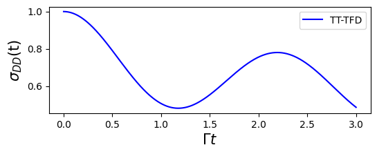

In this section, we introduce the tensor-train thermo-field dynamics (TT-TFD) method. Using the spin-boson model as an example, we demonstrate how TT-TFD can be used to simulate its quantum dynamics and compute the corresponding memory kernel.

The TT-TFD method has been fully integrated into the `qflux.GQME` module.

# What is TT-TFD?

The **thermo-field dynamics (TFD)** method enables the simulation of thermal quantum systems by **doubling the Hilbert space** and purifying the thermal density matrix into a pure state.  
In this framework, the Liouville–von Neumann equation

$$
\frac{d}{dt} \hat{\rho}(t) = -\frac{i}{\hbar} [\hat{H}, \hat{\rho}(t)]
$$

is mapped onto a Schrödinger-like equation for a thermal wave function:

$$
\frac{d}{dt} |\psi(\beta, t)\rangle = -\frac{i}{\hbar} \bar{H} |\psi(\beta, t)\rangle
$$

Here, $|\psi(\beta, t)\rangle$ is a vector in the doubled Hilbert space.  
The physical density operator is recovered by tracing out the auxiliary (fictitious) degrees of freedom:

$$
\hat{\rho}(t) = {\rm Tr}_f \{ |\psi(\beta, t)\rangle\langle \psi(\beta, t)|\}
$$

Because the doubling of the Hilbert space introduces an auxiliary space, the definition of the effective Hamiltonian $\bar{H}$ is not unique. Any choice that yields dynamics equivalent to the original Liouville equation after tracing over the auxiliary space is valid. Common choices include:

$$
\bar{H} = \hat{H} \otimes \tilde{I} - \hat{I} \otimes \tilde{H},
$$
or the simpler form
$$
\bar{H} = \hat{H} \otimes \tilde{I}.
$$

Here, operators with a "$\wedge$" act on the physical Hilbert space, while operators with a "$\sim$" act on the auxiliary (fictitious) Hilbert space.  
It can be verified that, for both definitions, taking the time derivative of $\mathrm{Tr}_f \{ |\psi(\beta, t)\rangle \langle \psi(\beta, t)| \}$ recovers the original Liouville–von Neumann equation.

Next, we consider the spin-boson model as an example and provide the explicit form of the effective Hamiltonian $\bar{H}$ and initial state $|\psi(\beta, 0)\rangle$ used in the thermo-field dynamics framework.


# The spin-boson model

The spin-boson model is a convenient and widely used framework for simulating electronic energy and charge transfer dynamics in chemical systems.
This model comprises two electronic states, representing a diabatic donor state
$\lvert D \rangle$ and an acceptor state $\lvert A \rangle$, coupled to a harmonic bath that interacts with the electronic degrees of freedom.

The total Hamiltonian can be written as:

$$
\hat{H} = \epsilon \hat{\sigma}_z + \Gamma \hat{\sigma}_x +\sum_{i = 1}^{N_{n}} \Bigg[\frac{\hat{P}_i^2}{2} + \frac{1}{2} \omega_i^2 \hat{R}_i^2 - c_i\hat{R}_i \hat{\sigma}_z\Bigg] 
$$

where $\hat{\sigma}_z = |D\rangle\langle D| - |A\rangle\langle A|$ and $\hat{\sigma}_x = |D\rangle \langle A| + |A\rangle\langle D|$ are the Pauli matrices for the electronic DOF (with $D$ standing for Donor and $A$ for acceptor), $2\epsilon$ is the energy gap between the electronic states, $\Gamma$ is the coupling between them, and $\hat R_i$ and $\hat P_i$ are the mass-weighted position and momentum operators of the $i$-th nuclear DOF.

The general discretized form of the nuclear modes frequencies and coupling coefficients, $\{\omega_{k} , c_{k}\}$, is given by

$$ J (\omega) = \frac{\pi}{2} \sum_{k=1}^{N_{n}} \frac{c_{k}^2}{\omega_{k}} \delta(\omega-\omega_{k}) $$

We sample the $\{\omega_{k} , c_{k}\}$ from an Ohmic spectral density with exponential cutoff:

$$ J (\omega) =  \frac{\pi\hbar}{2}\xi \omega e^{-\omega/\omega_{c}} $$

Here, $\xi$ is the Kondo parameter and $\omega_{c}$ is the cutoff frequency.

The initial state is assumed to be of the form

$$
\hat \rho(0) = \hat \sigma(0) \otimes \hat \rho_{n}(0)
$$

where $\hat{\sigma} (0) = |\gamma\rangle \langle \gamma |$ is the initial electronic density operator, where $|\gamma\rangle$ is one of the electronic basis states.
The initial nuclear density operator given by

$$ \hat{\rho}_{n} (0) = \frac{\exp\left[{\displaystyle -\beta \sum_{i = 1}^{N_{n}} \frac{\hat{P}_{i}^{2}}{2} + \frac{1}{2} \omega_{i}^{2} \hat{R}_{i}^{2}}\right]}{\text{Tr}_{n} \left\{ \exp\left[{\displaystyle -\beta\sum_{i = 1}^{N_{n}} \frac{\hat{P}_{i}^{2}}{2} + \frac{1}{2} \omega_{i}^{2} \hat{R}_{i}^{2}}\right] \right\}} $$

We set the parameters as:

```python
GAMMA_DA = 1 # diabatic coupling
EPSILON = 1
BETA = 5 # inverse finite temperature beta = 1 / (k_B * T)
XI = 0.1
OMEGA_C = 2
```

which are defined in [`qflux.GQME.params`](params.py).

## TT-TFD for spin-boson model

The TT-TFD method evolves the spin-boson model in an extended Hilbert space, which is defined as the tensor product of the electronic subsystem, the physical nuclear degrees of freedom, and their thermal-field replicas:

$$
\mathcal{H}_{\text{total}} = \mathcal{H}_e \otimes \mathcal{H}_n \otimes \tilde{\mathcal{H}}_n
$$  

Here:

- $\mathcal{H}_e$: Hilbert space of the two-level electronic system (donor/acceptor),
- $\mathcal{H}_n$: Hilbert space of the nuclear (bath) degrees of freedom,
- $\tilde{\mathcal{H}}_n$:  a fictitious copy of $\mathcal{H}_n$ introduced via the TFD formalism.

The initial thermal wave function

$$ |\psi(\beta, 0)\rangle = |\gamma\rangle \otimes \frac{e^{-\beta \hat{H}_n/2}}{\sqrt{Z(\beta)}}\sum_{k=\tilde{k}}|k\rangle\otimes |\tilde{k}\rangle $$

where $\hat{H}_{n} = \sum_{i = 1}^{N_{n}} \frac{\hat{P}_{i}^{2}}{2} + \frac{1}{2} \omega_{i}^{2} \hat{R}_{i}^{2}$ is the nuclear bath, and $|k\rangle$ is the bath state.

The preparation of the initial thermal wavepacket requires the evaluation of the quantum Boltzmann operator, which can be computationally challenging for systems with high dimensionality.
However, when the initial nuclear Hamiltonian is harmonic, the initial thermal wavepacket can be obtained by taking advantage of the thermal Bogoliubov transformation.
The transformation is defined by $e^{-i\hat{G}}$ with

$$
\hat{G} = -i \sum_{j} \theta_{j} (\hat{a}_j \tilde{a}_{j} - \hat{a}^{\dagger}_{j} \tilde{a}^{ \dagger }_{j})
$$

with $\theta_{j} = {\rm arctanh}(e^{-\beta \omega_{j} / 2})$, where $\{ \hat{a}_{j}, \hat{a}_{j}^{\dagger} \}$ and $\{ \tilde{a}_j, \tilde{a}_j^\dagger \}$ are the creation and annihilation operators associated with the $j$-th nuclear degree of freedom in the physical and tilde Hilbert spaces, respectively.

After the transformation, the TT-TFD equation becomes

$$
\frac{d}{dt} |\psi_{\theta}(\beta, t)\rangle = -\frac{i}{\hbar} \bar{H}_\theta |\psi_{\theta}(\beta, t)\rangle
$$

with

$$
\bar{H}_\theta = e^{i\hat{G}} \bar{H} e^{-i\hat{G}} = \epsilon \hat{\sigma}_z + \Gamma \hat{\sigma}_x + \sum_{i = 1}^{N_n} \left[ \omega_i \hat{a}_i^\dagger \hat{a}_i - \omega_i \tilde{a}_i^\dagger \tilde{a}_i + c_i {\rm cosh}\theta_i  \hat{\sigma}_z (\hat{a}_i^\dagger + \hat{a}_i) + c_i {\rm sinh}\theta_i  \hat{\sigma}_z (\tilde{a}_i^\dagger + \tilde{a}_i) \right]
$$

and the initial thermal wave function becomes

$$
|\psi(\beta, 0)\rangle = |\gamma\rangle \otimes |0, \tilde{0}\rangle 
$$

In practice, the $N_n$ pairs of $\{\omega_i , c_i\}$ are sampled from an Ohmic spectral density, and the TFD equations are solved in the tensor-train (TT) representation (for more details, see ["Tensor-Train Thermo-Field Memory Kernels for Generalized Quantum Master Equations"](https://doi.org/10.1021/acs.jctc.2c00892)).

## TT-TFD Implementation in qflux

The TT-TFD approach has been integrated into the `qflux` package.
The [time-dependent
variational principle (TDVP) method](https://doi.org/10.1137/140976546) is employed to propagate the TT-TFD. With the
help of the `mpsqd` package developed by [Guan et al.](https://doi.org/10.1063/5.0226214), tensor-train (TT) operations can be conveniently performed.


```python
!pip install "qflux[gqme]"
```


```python
import qflux.GQME.tt_tfd as tfd

#RDO: reduced density operator, contain the information of population and coherence
#initial_state=0: initial at Donor state
t, RDO_arr = tfd.tt_tfd(initial_state=0, show_steptime=True, update_type='rk4')
```

The result of the TT‑TFD simulation is shown in the figure below.
Where we plot the donor-state population $|D\rangle$ over time in the spin‑boson model.


```python
plt.figure(figsize=(6,2))
plt.plot(t, RDO_arr[:,0].real,'b-', label='TT-TFD')
plt.xlabel('$\Gamma t$',fontsize=15)
plt.ylabel('$\sigma_{DD}$(t)',fontsize=15)
plt.legend()
```

<figure markdown="span">
{: width="800"}
</figure>

# Summary

In this documentation, we introduce the tensor-train thermo-field dynamics (TT-TFD) method, a numerically exact approach for solving open quantum system dynamics:

* The definition of the spin-boson model is presented.

* The TT-TFD formulation for the spin-boson model is detailed, including discretization of the environment and the use of the thermal Bogoliubov transformation.

* The specific implementation of TT-TFD using `qflux` is described.

The TT-TFD approach provides an accurate and efficient framework for studying strongly coupled system–bath dynamics, and its integration in `qflux` offers a practical tool for real applications.
