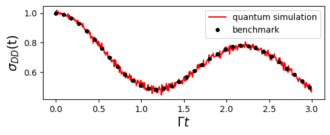

# Quantum Algorithms of GQME based on Dilation
In this section, we introduce the quantum simulation of the Generalized Quantum Master Equation (GQME).

Due to the interaction of the system with its surrounding environment, the dynamics of the reduced density operator are non-unitary. We express the formal solution of the reduced density operator as:

$$
\hat{\sigma} (t) = {\cal G} (t) \hat{\sigma} (0)~~. 
$$

where ${\cal G} (t)$ is the propagator. A key feature for open systems is that this propagator is generally a non-unitary matrix. Since quantum gates are inherently unitary, this poses a fundamental challenge for quantum computation.

In the following, we describe how to calculate the propagator using the GQME, and how to construct quantum circuits to simulate the dynamics by employing the dilation method introduced in [open system overview](../Open_Systems/basics.md).

Consistent with [GQME for Spin-Boson model](spin_boson_GQME.md), we continue to use the spin-boson model as an illustrative example.

## Solving the GQME to get the propagator

The propagator, similar to the reduced density operator, satisfies the same GQME governing its time evolution:

$$
\frac{d}{dt} {\cal G}(t) = -\frac{i}{\hbar} \langle \mathcal{L} \rangle_n^0 {\cal G}(t)- \int_0^t d\tau\ \mathcal{K}(\tau){\cal G}(t - \tau)~~.
$$

Therefore, starting from the identity superoperator ${\cal{G}}(0)= I$, one can solve the above GQME to obtain ${\cal{G}}(t)$. The definitions of $\langle \mathcal{L} \rangle_n^0$, $\mathcal{K}(\tau)$, and the procedure for solving the GQME have already been introduced in section [GQME for Spin-Boson model](spin_boson_GQME.md).

Below is an example code snippet showing how to solve for ${\cal{G}}(t)$ using `qflux`:

```python
from qflux.GQME.dynamics_GQME import DynamicsGQME

#============setup the Hamiltonian and initial state for Spin-Boson Model
Hsys = pa.EPSILON*pa.Z + pa.GAMMA_DA*pa.X
rho0 = np.zeros((pa.DOF_E,pa.DOF_E),dtype=np.complex128)
rho0[0,0] = 1.0

#Create the Spin-Boson model (SBM)
SBM = DynamicsGQME(pa.DOF_E,Hsys,rho0)
SBM.setup_timestep(pa.DT, pa.TIME_STEPS)

#read the precalculated kernel
timeVec, kernel = wr.read_superoper_array(pa.TIME_STEPS,"qflux/data/GQME_Example/K_Output/K_")

#solve the GQME for propagator
G_prop = SBM.solve_gqme(kernel, pa.MEM_TIME, dtype='Propagator')
```

Here, we first initialize the `DynamicsGQME` class with the parameters of the spin-boson model and load the precomputed memory kernel $\mathcal{K}(\tau)$. By setting `dtype='Propagator'` in the `solve_gqme` method, the GQME for the propagator can then be solved directly.

## Dilation of the non-unitary propagator

Next, we introduce the **Sz.-Nagy** dilation method ([Levy 2010](https://doi.org/10.48550/arXiv.1012.4514), [wang 2023](https://doi.org/10.1021/acs.jctc.3c00316))，This technique enables us to transform the non-unitary propagator ${\cal G}(t)$ into a unitary propagator that inhabits an extended Hilbert space.

We begin by evaluating the operator norm of $\mathcal{G}(t)$ to determine whether it qualifies as a **contraction**, which requires

$$
||\mathcal{G}(t)||_O = \sup \frac{||\mathcal{G}(t)\mathbf{v}||}{||\mathbf{v}||} \leq 1.
$$

If $\mathcal{G}(t)$ does not satisfy this condition, we introduce a scaling factor $n_c$ (chosen to be larger than $||\mathcal{G}(t)||_O$) to normalize it into a contraction form:

$$
\mathcal{G}'(t) = \frac{\mathcal{G}(t)}{n_c}.
$$

Once $\mathcal{G}'(t)$ is a contraction, we define its corresponding **unitary dilation operator** $\mathcal{U}_{\mathcal{G}'}(t)$ as

$$
\mathcal{U}_{\mathcal{G}'}(t) =
\begin{pmatrix}
\mathcal{G}'(t) & \mathcal{D}_{\mathcal{G}'^\dagger}(t) \\
\mathcal{D}_{\mathcal{G}'}(t) & -\mathcal{G}'^\dagger(t)
\end{pmatrix},
$$

where the so-called **defect operators** are given by

$$
\mathcal{D}_{\mathcal{G}'}(t) = \sqrt{I - \mathcal{G}'^\dagger(t)\mathcal{G}'(t)}
$$

and

$$
\mathcal{D}_{\mathcal{G}'^\dagger}(t) = \sqrt{I - \mathcal{G}'(t)\mathcal{G}'^\dagger(t)}.
$$

The resulting $\mathcal{U}_{\mathcal{G}'}(t)$ is a unitary superoperator defined on an enlarged Hilbert space of double the original dimension, and it effectively reproduces the action of $\mathcal{G}'(t)$ when restricted to the original system subspace.

As described in [open system overview](../Open_Systems/basics.md), these steps have been fully integrated into the `qflux.open_systems.quantum_simulation` module. The `set_dilation_method` function in the `QubitDynamicsOS` class supports several different dilation methods, with `'Sz-Nagy'` set as the default option.

## Quantum Simulation of GQME

The following code implements the quantum simulation of the GQME using [Qiskit’s QASM simulator](
https://doi.org/10.48550/arXiv.2405.08810).

```python
from qflux.open_systems.quantum_simulation import QubitDynamicsOS

qSBM = QubitDynamicsOS(rep='Density', Nsys = pa.DOF_E, Hsys = Hsys, rho0 = rho0)
qSBM.set_count_str(['000','011'])
qSBM.set_dilation_method('Sz-Nagy')

res_qc = qSBM.qc_simulation_vecdens(timeVec,Gprop=G_prop)
pop_qc = res_qc['data']
```

Here, we instantiate the `QubitDynamicsOS` class with the parameters of the spin-boson model, set the final measurement states, and specify the dilation method. The `qc_simulation_vecdens` method supports quantum simulation with the propagator as input.

The population results are shown in the figure below.



One can also visualize an example quantum circuit from the result output of the `qc_simulation_vecdens` method:
```python
res_qc['circuits'][200].draw('mpl')
```

Here, we use the circuit at the 200th time step as an example.

Furthermore, one can appreciate the circuit complexity by decomposing it into fundamental gates:
```python
res_qc['circuits'][200].decompose().draw('mpl')
```


# Summary
This example demonstrates a modular quantum simulation of the Generalized Quantum Master Equation (GQME) using the spin-boson model as an illustrative example:

* The propagator of the reduced density operator satisfies the GQME. By utilizing a precomputed memory kernel, the GQME is solved to obtain the propagator.

* The Sz.-Nagy dilation method is employed to transform the non-unitary propagator of the open system into a unitary operator in an extended Hilbert space.

* Quantum circuits are constructed and executed, and the simulation results are benchmarked against exact GQME calculations.

