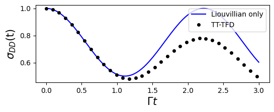
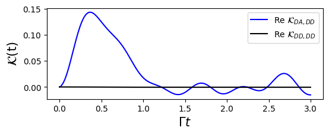
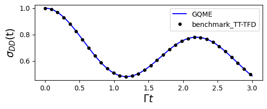

# GQME for Spin-Boson model
This documentation describes how to simulate the dynamics of a spin-boson system using the generalized quantum master equation (GQME). This simulation also includes comparison plots to the numerically exact results obtained via tensor-train thermo-field dyanmics (TT-TFD).

The following modules will be used throughout the documentation:
```python
import numpy as np
import time
import matplotlib.pyplot as plt

import qflux.GQME.params as pa
import qflux.GQME.readwrite as wr
```
---

## Spin Boson Model Hamiltonian

The total Hamiltonian for the spin-boson model can be written as:

$$
\hat{H} = \epsilon \hat{\sigma}_z + \Gamma \hat{\sigma}_x + \sum_{i=1}^{N_n} \left[ \frac{\hat{P}_i^2}{2} + \frac{1}{2} \omega_i^2 \hat{R}_i^2 - c_i \hat{R}_i^2 - c_i \hat{R}_i \hat{\sigma}_z \right]
$$

where $\lvert D \rangle$ and $\lvert A \rangle$ are the electronic donor state and acceptor state, respectively.  $\hat{\sigma}_z = \lvert D \rangle \langle D \rvert  - \lvert A \rangle \langle A \rvert$,
$\hat{\sigma}_x = \lvert D \rangle \langle A \rvert + \lvert A \rangle \langle D \rvert$,
$2\epsilon$ is the reaction energy and $\Gamma = V_{DA}$ is the electronic coupling between the donor and acceptor states. More details about the model can be found in [Introduction to TT-TFD](What_is_TTTFD.md) page. 

The initial state is assumed to be of the form

$$
\hat \rho(0) = \hat \sigma(0) \otimes \hat \rho_n(0)
$$

With

$$
\hat{\sigma}(0) = \lvert D \rangle\langle D \rvert
$$

and 

$$\hat{\rho}_n (0) = \frac{\exp\bigg[\displaystyle -\beta \sum_{i = 1}^{N_n} \frac{\hat{P}_i^2}{2} + \frac{1}{2} \omega_i^2 \hat{R}_i^2\bigg]}{\text{Tr}_n \Bigg\{ \exp\bigg[\displaystyle -\beta\sum_{i = 1}^{N_n} \frac{\hat{P}_i^2}{2} + \frac{1}{2} \omega_i^2 \hat{R}_i^2\bigg] \Bigg\}}$$


By treating all nuclear degrees of freedom as the environment, the GQME for the spin-boson model can be written as follows: 

$$
\frac{d}{dt}\hat{\sigma}(t) = -\frac{i}{\hbar}\langle \mathcal{L}\rangle_n^0\hat{\sigma}(t) - \int_0^t d\tau\, \mathcal{K}(\tau)\hat{\sigma}(t - \tau) \tag{1}
$$
 
Here, $\hat{\sigma}(t)$ denotes the reduced density operator, which only includes the system degrees of freedom and is a $2×2$ matrix. 

To propagate the GQME, two quantities are required: the projected Liouvillian $\langle {\cal L} \rangle_n^0$ and the memory kernel $\mathcal{K}(t)$. Their computation is described below.

## The projected Liouvillian

When the memory kernel is absent, the system dynamics are governed solely by the projected Liouvillian $\langle {\cal L} \rangle_n^0$. Therefore, $\langle {\cal L} \rangle_n^0$ represents the unitary dynamics of the isolated system without environmental effects.

The pure system Hamiltonian is given by $H_S = \epsilon \hat{\sigma}_z + \Gamma \hat{\sigma}_x$, and $\langle {\cal L} \rangle_n^0$ is defined through its action on an arbitrary electronic operator $\hat{A}$:

$$
\langle {\cal L} \rangle_n^0 \hat{A} = \left[H_S,\hat{A} \right] .
$$


The `DynamicsGQME` class in the `qflux.GQME` module provides methods for performing GQME calculations. The following code snippet shows how to initialize a `DynamicsGQME` object and define the initial reduced density operator and $H_S$.
Then the method `DynamicsGQME.prop_puresystem()` allows for time evolution of the isolated system:

```python
from qflux.GQME.dynamics_GQME import DynamicsGQME
import scipy.linalg as LA

#============setup the Hamiltonian and initial state for Spin-Boson Model
Hsys = pa.EPSILON*pa.Z + pa.GAMMA_DA*pa.X
rho0 = np.zeros((pa.DOF_E,pa.DOF_E),dtype=np.complex128)
rho0[0,0] = 1.0

#Create the Spin-Boson model (SBM)
SBM = DynamicsGQME(pa.DOF_E,Hsys,rho0)
SBM.setup_timestep(pa.DT, pa.TIME_STEPS)

#=========== Propagate the density matrix under the pure system Liouvillian
sigma_liou = SBM.prop_puresystem()
```

The results are shown in the figure below, along with the numerically exact TT-TFD results for comparison. As expected, the evolution of the isolated system exhibits no decay and no energy dissipation.



## The Memory Kernel
According to [Introduction to GQME](What_is_GQME.md), the memory kernel can be obtained through the projection-free inputs (PFIs) $\mathcal{F}(t)$ and $\dot{\mathcal{F}}(t)$: 

$$
\mathcal{K}(t) 
= i\dot{\mathcal{F}}(t) 
- \frac{1}{\hbar}\mathcal{F}(t)\langle \mathcal{L}\rangle_n^0 
+ i\int_{0}^{t} d\tau \, \mathcal{F}(t - \tau)\mathcal{K}(\tau)
$$

with $\mathcal{F}(t) = i\dot{\mathcal{G}}(t)$ is the time-derivative of the propagator $\mathcal{G}(t)$. 

The propagator is a super-operator with the matrix element $\mathcal{G}_{jk,lm}(t)$ ($j, k, l, m \in \{D, A\}$) can be calculated by starting from initial state $|l⟩⟨m| ⊗ \hat{\rho}_n(0)$, measure the $\sigma_{jk}(t)$ at time $t$. 

Here, we compute the propagator using the Tensor-Train Thermo-Field Dynamics (TT-TFD) approach, which in our `qflux.GQME` implementation is integrated into the `cal_propagator_tttfd()` method of the `DynamicsGQME` class.

```python
# Compute the full system propagator using TT-TFD
timeVec, Gt = SBM.cal_propagator_tttfd()
print('End of calculate propagator')

# Save the computed propagator for future use
wr.output_superoper_array(timeVec, Gt, "qflux/data/GQME_Example/U_Output/U_")
```

Because this step can be computationally costly, the results are precomputed and saved. Alternatively, one can directly load the propagator data and set it in the `DynamicsGQME` class.

```python
# Load precomputed propagator from file
timeVec, Gt = wr.read_superoper_array(pa.TIME_STEPS, "qflux/data/GQME_Example/U_Output/U_")
    
# Set the propagator in the SBM object for later use
SBM.setup_propagator(Gt)
```

Once the propagator ${\cal G}(t)$ is calculated, the memory kernel ${\cal K}(t)$ can be obtained by solving the above Volterra integral equation. In `qflux`, this equation is solved using an iterative algorithm, which has been integrated into the `get_memory_kernel` method of the `DynamicsGQME` class.

```python
#=========== Solve Volterra equation to obtain the memory kernel
kernel = SBM.get_memory_kernel()
```
A representative result of the memory kernel is shown in the figure below. It captures the influence of the environment on the system dynamics, leading to non-Markovian behavior. The nonzero $\mathcal{K}_{DA,DD}(t)$ component in the figure indicates that the bath-induced population $\sigma_{DD}$ at an earlier time can influence the coherence dynamics of $\sigma_{DA}$ at a later time.



# Propagating System Dynamics using GQME
With both the projected Liouvillian and the memory kernel available, Eq. (1) can be directly solved. The `solve_gqme` method in the `DynamicsGQME` class employs the fourth-order Runge-Kutta (RK4) method to solve the GQME. By providing the memory kernel and specifying a cutoff memory time, the `solve_gqme` method directly integrates the GQME and returns the reduced density operator $\hat{\sigma}(t)$.

```python
#=========== Propagate system dynamics using the GQME
sigma = SBM.solve_gqme(kernel, pa.MEM_TIME)
```

We visualize the simulations by plotting the observable $\sigma(t)$. The comparison between the GQME and exact results obtained via TT-TFD offers a benchmark for accuracy.

```python
## Plotting Results
#=========== Plot the 0th state population from both methods
plt.figure(figsize=(6,2))
plt.plot(timeVec, sigma[:, 0].real, 'b-', label='GQME')
plt.plot(timeVec, sigma_tt_tfd[:, 0].real, 'ko', markersize=4, markevery=15, label='benchmark_TT-TFD')
plt.xlabel('', fontsize=15)
plt.ylabel(r'$\sigma_{00}(t)$', fontsize=15)
plt.legend()
```


---

# Summary
This example demonstrates a modular simulation of an open quantum system using the Generalized Quantum Master Equation (GQME) framework:

* The spin-boson model is used as an illustrative example, and its corresponding GQME is presented.
* A numerically exact approach based on Tensor-Train Thermo-Field Dynamics (TT-TFD) is provided to compute the memory kernel.
* The GQME is explicitly solved and benchmarked against exact TT-TFD calculations.

The combination of TT-TFD for accurate short-time dynamics and the GQME for efficient long-time propagation offers a powerful framework for studying open quantum systems with realistic environmental couplings.

