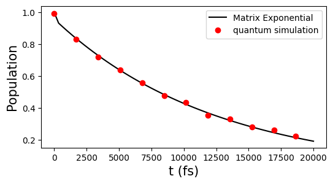

# The Double-Well System

This documentation describes how to simulate the open quantum dynamics of a double-well potential system, which is more familiar to those with a background in chemistry. In particular, we use the potential energy surface corresponding to the hydrogen bond within the adenine–thymine (A–T) base pair in DNA, and simulate the proton transfer process at the interface of an individual A–T pair. Due to the large Hilbert space involved in such systems, we introduce more advanced techniques, including how `qflux` utilizes the Kraus operator representation to construct quantum circuits and perform quantum simulations. The framework supports both classical and quantum computational backends and includes comparison plots to evaluate different solver strategies.

The adenine–thymine base pair model follows the description in [this paper](https://pubs.rsc.org/en/content/articlelanding/2015/cp/c5cp00472a). For a schematic illustration of the model, see the [Adenine-Thymine Base Pair](../Closed_Systems/AT_basepair.md) section.


The following modules will be used throughout the documentation:
```python
import numpy as np
import matplotlib.pyplot as plt
```


```python
import qflux.open_systems.params as pa
from qflux.open_systems.numerical_methods import DynamicsOS
from qflux.open_systems.quantum_simulation import QubitDynamicsOS
import qflux.open_systems.trans_basis as tb
```

In this documentation, solving the double-well system amounts to solving the following Lindblad equation:

$$
\dot{\rho}(t) = -i[\hat{H}, \rho(t)] +
\kappa(1 + n_{\mathrm{th}}) \left( \hat{a} \rho(t) \hat{a}^{\dagger}
- \frac{1}{2} \left\{ \hat{a}^{\dagger} \hat{a}, \rho(t) \right\} \right)
+ \kappa n_{\mathrm{th}} \left( \hat{a}^{\dagger} \rho(t) \hat{a}
- \frac{1}{2} \left\{ \hat{a} \hat{a}^{\dagger}, \rho(t) \right\} \right)
$$

The double well system's Hamiltonian $H$ is given by:

$$ H = \frac{p^2}{2m} + V(x)   $$

where $p$ is the proton's momentum, $m=1836.15$ a.u. is the mass of the proton, and the double well potential is defined by setting $V(x)$.

The effect of the environment is incorporated through the jump operators $\hat{a}$ and $\hat{a}^\dagger$, as in [this paper](https://doi.org/10.48550/arXiv.2211.04605). Here, $\hat{a}$ and $\hat{a}^\dagger$ are the annihilation and creation operators, defined as:

$$
\hat{a} = \sqrt{\frac{m\omega}{2\hbar}}\,\hat{x} + \frac{i}{\sqrt{2\hbar m \omega}}\,\hat{p}
$$

$$
\hat{a}^\dagger = \sqrt{\frac{m\omega}{2\hbar}}\,\hat{x} - \frac{i}{\sqrt{2\hbar m \omega}}\,\hat{p}
$$

The parameter $\kappa$ characterizes the coupling strength between the system and the environment, while $n_{\mathrm{th}} = 1/(\exp(\hbar \omega/k_B T)-1)$ is the thermally averaged occupation number of the environmental harmonic oscillator at temperature $T$. We choose $\kappa = 1/10\, {\rm fs}^{-1}$ and $T=300 \, {\rm K}$  (corresponding to $n_{th} = 0.01$ a.u.).


## Set Up the Double Well Potential

We begin by defining the double-well potential $V(x)$. To simulate the system on a computer, the spatial coordinate $x$ is discretized onto a finite grid. The `DVR_grid` class in the `numerical_methods` module enables the discretization of continuous functions onto a discrete variable representation (DVR).

The following code defines the double-well potential function `pot_doublewell` for a proton, and discretizes the potential onto $1024$ DVR grid points over the range from $-4.0$ to $4.0$:


```python
from qflux.open_systems.numerical_methods import DVR_grid

#=============set up the double well in the grid point representation
def pot_doublewell(x, f=0.0367493, a0=0.0, a1=0.429, a2=-1.126, a3=-0.143, a4=0.563):
    # A-T pair double-well potential in Hartrees (x is in Bohr)
    xi = x/1.9592
    return f*(a0 + a1*xi + a2*xi**2 + a3*xi**3 + a4*xi**4)

mass0 = 1836.15
beta = pa.au2joule/(pa.bolz*300) #1/(kT) in a.u. units
omega = 0.00436 #the frequency associate with the right well
kappa = 1/(10/pa.au2fs)
nth = 1/(np.exp(beta*omega)-1)

dw_grid = DVR_grid(xmin = -4.0, xmax = 4.0, Ngrid = 1024, mass = mass0)

dw_grid.set_potential(pot_doublewell)
```

The plot of the potential $V(x)$ is shown here:

<figure markdown="span">
{: width="800"}
</figure>


The population of the proton in the left (L) and right (R) wells can be characterized by the following expectation values:

$$
P_R = \langle \Theta(x - x^*) \rangle
$$

$$
P_L = \langle 1 - \Theta(x - x^*) \rangle
$$

where $\langle A \rangle = {\rm Tr}[A \rho]$ for a given operator $A$, $\Theta (x)$ is the Heaviside function and $x^*$ defines the dividing surface between the left and right wells. Here, $x^* =0.37321768$ a.u. corresponds to the position at the top of the barrier.

## Visualize the Eigenstates of the Potential

We can diagonalize the double-well system Hamiltonian $H$ to obtain its eigenstates:

$$ H|\phi_i\rangle = E_i |\phi_i\rangle $$

Once the potential is defined, the `get_eig_state` method of the `DVR_grid` class can be used to solve for the eigenstates of $H$. By specifying the `Neig` parameter, one can compute the lowest `Neig` eigenstates of the system.


```python
#=============The eigen_state
Neig = 32
eneg_DW,psi_DW = dw_grid.get_eig_state(Neig)
```

We can visualize the potential energy surface along with the energy levels and spatial distributions of the lowest 12 eigenstates.

<figure markdown="span">
{: width="800"}
</figure>

## Express the Double Well in the Basis of Eigenstates

Due to the large size of the density matrix in the DVR representation, we perform a basis transformation. Specifically, we use the previously computed eigenstates as a reduced basis set for subsequent calculations and express all operators and observables in this eigenstate basis.


```python
#==================Express the operators in terms of eigenstate basis===========
psik_DW = np.zeros((dw_grid.Ngrid,Neig),dtype=np.complex128)
for i in range(Neig):
    psik_DW[:,i] = dw_grid.x2k_wave(psi_DW[:,i])

# hamiltonian
H_dw = np.diag(eneg_DW)

# The operator in the eigenstate
xmat_eig = tb.trans_basis_diag(dw_grid.xgrid, Neig, psi_DW)*dw_grid.dx
pmat_eig = tb.trans_basis_diag(dw_grid.kgrid, Neig, psik_DW)*dw_grid.dk

# creation/annihilation operator
amat_eig = xmat_eig.copy()*np.sqrt(mass0*omega/2)+1j*pmat_eig.copy()/np.sqrt(mass0*omega*2)
adegmat_eig = xmat_eig.copy()*np.sqrt(mass0*omega/2)-1j*pmat_eig.copy()/np.sqrt(mass0*omega*2)

# define the population on the left/right well and transform to eigen state basis
x_barrier = 0.37321768
P_R = np.heaviside(xgrid-x_barrier,1)
P_L = 1 - np.heaviside(xgrid-x_barrier,1)

P_R_eig = tb.trans_basis_diag(P_R, Neig, psi_DW)*dw_grid.dx
P_L_eig = tb.trans_basis_diag(P_L, Neig, psi_DW)*dw_grid.dx
```

## Set Up the Initial State

We set the initial state to the eigenstate $|\phi_6\rangle$, which is the first eigenstate localized in the right well:

$$
|\psi(0)\rangle = |\phi_6\rangle; \quad \rho(0) = |\psi(0)\rangle \langle \psi(0)|
$$


```python
#initial density matrix
ini_occu = np.zeros(Neig,dtype=np.complex128)
ini_occu[5] = 1.0
rho0 = np.outer(ini_occu,ini_occu.conj())
```

## Classical Simulation

Following a similar procedure as outlined in [Basics of open system simulation](basics.md), we use the predefined initial state, system Hamiltonian, collapse operators, and observables to instantiate the `DynamicsOS` class. We then perform long-time evolution using the `propagate_matrix_exp` method.


```python
gamma1 = np.sqrt(kappa*(nth+1))
gamma2 = np.sqrt(kappa*(nth))
c_ops = [gamma1*amat_eig, gamma2*adegmat_eig]

#instantiate the DynamicsOS class
dw_eig = DynamicsOS(Nsys = Neig, Hsys = H_dw, rho0 = rho0, c_ops = c_ops)

#the observable
observable = P_R_eig

#propagate to long time
time_long = np.linspace(0,20000/pa.au2fs,60)

#propagate using matrix exponential propagation
result_dw_l = dw_eig.propagate_matrix_exp(time_long, observable, Is_store_state = True, Is_show_step=True, Is_Gt=True)
```

We can visualize the population in the right well as a function of time:

<figure markdown="span">
{: width="800"}
</figure>


We can also visualize the time evolution of the proton's probability distribution over the double-well potential:

<video controls src="../../images/Part_II/double_well_open_evolution.mp4"></video>

## Quantum Simulation

Using the `QubitDynamicsOS` class from the `qflux.open_systems.quantum_simulation` module, `qflux` enables quantum simulation of the Lindblad equation. When the system has a Hilbert space dimension of $N=32$, the vectorized density matrix becomes a state vector of dimension $N^2$, and the corresponding propagator is of size $N^2 \times N^2$. For such large-dimensional systems, we can utilize the Kraus operator representation to evolve the system dynamics.

Therefore, compared to the approach used in the [Basic of open system simulation example](./basics.md)—where quantum circuits are constructed based on the full propagator—the Kraus operator representation reduces the number of required qubits from $log_{2}N^2$ to $log_2 N$. However, the trade-off is that multiple circuits (corresponding to multiple Kraus operators) must be executed.

The Kraus operator representation is defined as:

$$
    \rho(t) = \sum_i M_i(t) \rho(0) M_i^\dagger (t)
$$

where $M_i(t)$ are the Kraus operators ($N\times N$ matrix) that describe the evolution of the system. These Kraus operators define a mapping from $\rho(0)$ to $\rho(t)$. This approach avoids the need to vectorize the density matrix and instead evolves a state vector directly in the system's original $N$-dimensional Hilbert space.

With the initial density matrix written as $\rho(0)  = \sum_n p_n(0) |\psi_n (0)\rangle \langle \psi_n (0)|$ (in our example, $\rho (0) = | \phi_{6} \rangle \langle \phi_{6} |$ ), we have

$$
    \rho(t) = \sum_{in} p_n(0) |\psi_n (0)\rangle \langle \psi_n (0)| \;\;
$$

where

$$
    |\psi^i_n(t)\rangle =  M_i(t) |\psi_n (0)\rangle
$$

is the state obtained by applying the Kraus operator $M_i(t)$ to the initial state $|\psi_n (0)\rangle$.


Quantum simulation can be carried out through the following steps:

- Initialize the qubit statevector to $|\psi_n (0)\rangle$.

- Construct Kraus operators $M_i(t)$ and the corresponding quantum gates $\mathbf{U}_{M_i}(t)$. For non-unitary $M_i(t)$, `qflux` provides a dilation method (default: `'Sz.-Nagy'`) to implement the operation within an enlarged Hilbert space.

- Execute the quantum circuits to obtain $|\psi^i_n(t)\rangle$ for each Kraus path, and reconstruct the density matrix from all resulting trajectories $|\psi^i_n(t)\rangle$.

For the observable $P_R (t)$, we have:

$$
\begin{aligned}
    P_R(t) &= \mathrm{Tr}[\rho(t) \hat{P}_R] \\
           &= \sum_i \mathrm{Tr}\left[ M_i(t) |\psi(0)\rangle\langle \psi(0)| M_i^\dagger(t) \, \hat{P}_R \right] \\
           &= \sum_i \langle \psi_i(t) | \hat{P}_R | \psi_i(t) \rangle,
\end{aligned}
$$

which means that in quantum simulation, one simply needs to measure the expectation value of $\hat{P}_R$  with respect to each $|\psi^i_n(t)\rangle$, and then sum over all results to obtain $P_R (t)$.

`qflux` provides quantum circuit simulation based on the Kraus operator representation. To enable this, one simply needs to set `rep='Kraus'` when instantiating the `QubitDynamicsOS` class.

The `qc_simulation_kraus` function can then be used to simulate the Lindblad dynamics using the Kraus operator representation. 

This function first computes the propagator (unless it is provided as input), and then calls the [`gen_Kraus_list`](../../../src/qflux/open_systems/quantum_simulation.py) method to construct the corresponding set of Kraus operators from the propagator, using methods described in [this paper](https://doi.org/10.1063/1.1518555) and [this paper](https://doi.org/10.1021/acsomega.3c09720), with a specified tolerance parameter `tolk`.

Once the Kraus operators are obtained, `qc_simulation_kraus` performs the quantum simulation and evaluates the observable of interest — in this case,  $\hat{P}_R$:

```python
#extract the propagator from result of classical simulation,
#and expand to match the dimension of qubit space
#For saving calculation, only choose some time points
ilarge = 5
nsteps = int(len(time_long)/ilarge)
time_qdw = np.zeros(nsteps)
Gprop_dw = []

for i0 in range(nsteps):
    i = i0*ilarge
    org_dim = result_dw_l.density_matrix[i].shape[0]
    Gprop_dw.append(result_dw_l.Gprop[i])

    time_qdw[i0] = time_long[i]

#double well instance
dw_quantum = QubitDynamicsOS(rep='Kraus', Nsys=Neig, Hsys=H_dw, rho0=rho0, c_ops = c_ops)
dw_quantum.set_observable(P_R_eig)

#running the quantum simulation
P_dw_qc = dw_quantum.qc_simulation_kraus(time_qdw, Gprop = Gprop_dw, tolk = 1E-2, tolo = 5E-3)
```

One can visualize $P_R(t)$ after the simulation is complete:

<figure markdown="span">
{: width="800"}
</figure>

