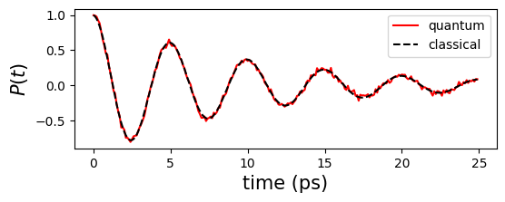

# Tutorial on Simulating Open Quantum System Dynamics

Here, we present the general procedure for simulating open quantum system dynamics using `qflux`.

## What is Open Quantum System?

An open system represents a system that interacts with its surrounding environment, and these interactions fundamentally affect the dynamics of the system. Due to the presence of the environment, the system’s evolution can no longer be described by the Schrödinger equation. For instance, while the Schrödinger equation describes unitary evolution with conserved system energy, open systems exhibit energy exchange with the environment, which can lead to gradual energy dissipation.

Due to the large number of degrees of freedom in the environment, it is generally impractical to directly solve the Schrödinger equation for the combined system and environment. As a result, many equations of motion have been developed to describe the dynamics of open quantum systems under various approximations. One of the most general forms of a trace-preserving evolution equation is the Lindblad master equation, given by

$$ \frac{d\rho{(t)}}{dt} = - \frac{i}{\hbar}[H,\rho(t)] + \frac{1}{2}\sum_n\gamma_n\left[2L_n \rho(t)L_n^\dagger - \rho(t) L_n^\dagger L_n - L_n^\dagger L_n \rho(t)\right]. $$

In this equation, here $\rho(t)$ is the reduced density matrix of the system, and $H$ represents the Hamiltonian of the system. The jump operators $L_n$ represent the environmental effects on the dynamics, with the rates $\gamma_n$ quantifying these effects.

The purpose of this tutorial is to demonstrate how to solve the Lindblad equation described above using `qflux`, both on classical and quantum computing platforms. To that end, we first introduce the general procedure for solving the equation, and then illustrate it with a spin-1/2 example to familiarize the reader with the basic usage of `qflux`.

To numerically solve the Lindblad equation, `qflux` adopts a matrix–vector multiplication approach. This method leverages commonly used Python packages such as `NumPy` and `SciPy`, and consists of three main steps:
- vectorizing the density matrix,
- converting the Lindblad equation into a matrix–vector form
- integrating the resulting equation to obtain the time evolution of the system.

(i) Vectorizing the density matrix:

The density matrix $\rho(t)$ of a system with an N-dimensional Hilbert space is an $N\times N$ matrix. For numerical purposes, it is reshaped into a vector of dimension $N^2$.

$$\rho \to |\nu_{\rho} \rangle= \left[ \rho_{11}, \ldots, \rho_{1N}, \rho_{21}, \ldots, \rho_{2N}, \ldots, \rho_{N1}, \ldots, \rho_{NN} \right]^\top,$$

Here the superscript ``$\top$'' represents a transpose operation.

(ii) Converting the Lindblad equation into a matrix–vector form

The Lindblad equation can be recasted into the equivalent matrix-vector form:

$$\frac{\mathrm{d}|\nu_{\rho}(t) \rangle}{\mathrm{d}t} = -i H_{\mathrm{eff}} |\nu_{\rho}(t) \rangle\;\;,$$

Where the effective Hamiltonian is $H_{\mathrm{eff}} = H_C + i H_D$, with $H_C$ and $H_D$ representing the $N^2 \times N^2$ matrix forms of the commutator and the Lindbladian dissipator, respectively:

$$ H_C = H \otimes \mathbb{I}-\mathbb{I} \otimes H^T ~~, $$

$$ H_D = \sum_{n} \frac{1}{2} \gamma_{n} \left[ 2L_{n}\otimes L^*_{n} - \mathbb{I}\otimes L^T_{n} L^*_{n} - L^\dagger_{n} L_{n} \otimes \mathbb{I}
    \right] ~~, $$

Here, $L^*_{n}$ is the complex conjugate of $L_{n}$ and $\mathbb{I}$ is the identity matrix in the Hilbert space of the Hamiltonian $H$.

(iii) Integrating the Lindblad equation

The density matrix at time $t$ can be expressed
as the action of the exponential of the matrix $-i H_{\mathrm{eff}}$ on the vectorized density matrix at $t=0$,

$$ 
| \nu_{\rho}(t)\rangle = \mathbf{G}(t)  
    | \nu_{\rho}(0)\rangle . 
$$

Where $\mathbf{G}(t)$ is called the propagator, and is defined as $\mathbf{G}(t)=e^{-i H_{\mathrm{eff}}t}$.


## Solve the Lindblad equation

As a reminder, the task at hand is compute the time evolution of the density matrix according to the Lindblad equation:

$$
    | \nu_{\rho}(t)\rangle = \mathbf{G}(t)  
    | \nu_{\rho}(0)\rangle ~~.
$$

To do this, we must:
- Define the initial state $| \nu_{\rho}(0)\rangle$
- Define the propagator $\mathbf{G}(t)$ describing the time-evolution.
- Define a propgation time-step and the number of time steps for which we want to compute the evolved density matrix.

### Definition of the Initial State

The initial state is the vectorized density matrix $| \nu_{\rho}(0)\rangle$. However, the `DynamicsOS` class in `qflux.open_system` automatically performs the vectorization, so the user only needs to define the initial density matrix $\rho(0)$ as an $N\times N$ array and pass it to the `DynamicsOS` class.

As an example, consider a single spin-1/2 system. We define the spin-up and spin-down states as

$$  
|\uparrow\rangle = |0\rangle = \begin{bmatrix} 1 \\ 0 \end{bmatrix}, \qquad
    |\downarrow\rangle = |1\rangle = \begin{bmatrix} 0 \\ 1 \end{bmatrix} ~~.
$$

This Hilbert space dimension of spin-1/2 is 2, so the initial density matrix $\rho(0)$ is a $2\times 2$ array.
If the system is initially in the spin-up state, then

$$
\rho(0) = |0\rangle\langle 0| .
$$

This can be defined in Python as:


```python
import numpy as np
# Initial density matrix
spin_up = np.array([1.0, 0.0], dtype=np.float64)
spin_down = np.array([0.0, 1.0], dtype=np.float64)
rho0_1spin = np.outer(spin_up, spin_up.conj())
```

### Definition of the propagator

The propagator $\mathbf{G}(t)$ is defined as $\mathbf{G}(t)=e^{-i H_{\mathrm{eff}}t}$. Where the effective Hamiltonian is $H_{\mathrm{eff}} = H_C + i H_D$, with

$$
    H_C = H \otimes \mathbb{I}-\mathbb{I} \otimes H^T ~~,
$$

$$
    H_D = \sum_{n} \frac{1}{2} \gamma_{n} \left[ 2L_{n}\otimes L^*_{n} - \mathbb{I}\otimes L^T_{n} L^*_{n} - L^\dagger_{n} L_{n} \otimes \mathbb{I}
    \right] ~~,
$$

Given the system Hamiltonian $H$, the jump operators $L_n$, and their corresponding rates $\gamma_n$, the propagator $\mathbf{G}(t)$ is fully specified.

The computation of $\mathbf{G}(t)$ is encapsulated within the `Gt_matrix_expo` function of the `DynamicsOS` class. The user only needs to provide $H$, $L_n$, and $\gamma_n$ during the initialization of the `DynamicsOS` class.

Continuing with the spin-1/2 system as an example, we define the Hamiltonian as

$$
H = E_0 \sigma^z + \Delta \sigma^x,
$$

where $\sigma^z$ and $\sigma^x$ are Pauli matrices.


```python
X = np.array([[0, 1], [1, 0]], dtype=np.complex128)
Y = np.array([[0, -1j], [1j, 0]], dtype=np.complex128)
Z = np.array([[1, 0], [0, -1]], dtype=np.complex128)

E0 = 0.0
Delta = 0.1 * np.pi * 2

# The Spin-1/2 system Hamiltonian
H_1spin = E0*Z + Delta*X
```

Here we set $E_0 = 0$, $∆ = 0.1 \times 2π$. In `qflux`, the jump operator $L_n$ and the damping rate $\gamma_n$ are combined into a collapse operator, defined as
$C_n = \sqrt{\gamma_n}L_n$. This collapse operator is then passed to the `DynamicsOS`. For example, if only a single jump operator exist with $L = \sigma^x$ and $\gamma=0.05$, we have:


```python
# The jump operator and damping rate of Spin-1/2 system
gamma_1spin = 0.05
L_1spin = np.sqrt(gamma_1spin)*X
```

With these definitions in place, the `DynamicsOS` class can be initialized as follows:


```python
from qflux.open_systems.numerical_methods import DynamicsOS
spin1_dissipative = DynamicsOS(Nsys=2, Hsys=H_1spin, rho0=rho0_1spin, c_ops = [L_1spin])
```

Note that the `c_ops` argument in `DynamicsOS` is a list. For example, setting `c_ops = [L_1spin]` specifies that the Lindblad equation involves only a single collapse operator `L_1spin`. If multiple collapse operators are present, they can be simulated by simply including all of them in the list.

If no collapse operators are specified, `c_ops` defaults to an empty list. In this case, the code will still run, corresponding to the solution of the Liouville–von Neumann equation for a closed system (i.e., unitary evolution without environmental effects).

### Define Simulation Time and Run the Dynamics

Given a time array for the simulation, the `propagate_matrix_exp` method in the `DynamicsOS` class computes the time evolution operator $\mathbf{G}(t)$, and subsequently solves the Lindblad equation to obtain the density matrix $\rho(t)$. If an observable is specified, the method also returns the time-dependent expectation values of that observable.


```python
time_arr = np.linspace(0, (250 - 1) * 0.1, 250)
#matrix exponential propagation
result_matrix_exp = spin1_dissipative.propagate_matrix_exp(time_arr=time_arr, observable=Z, Is_store_state=True, Is_Gt = True)
```

After execution, `result_matrix_exp` is an object that contains the following information evaluated at each time in `time_arr`:

- A list of expectation values of the observable

- A list of density matrices (if `Is_store_state=True`), and

- A list of propagators (if `Is_Gt=True`).

Note that in most cases, only the observable is of interest. Therefore, both `Is_store_state` and `Is_Gt` are set to `False` by default.

`qflux` also provides an interface to the `mesolve` function from `QuTiP` as an alternative method for propagating the Lindblad equation, which facilitates direct comparison between different approaches. It is integrated into the `propagate_qt` method of the `DynamicsOS` class.


```python
expec_vals_qutip_Lindblad = spin1_dissipative.propagate_qt(time_arr=time_arr, observable=Z)
```
    

## Quantum Simulation of the Lindblad Equation

Using the `QubitDynamicsOS` class from the `qflux.open_systems.quantum_simulation` module, `qflux` enables quantum simulation of the Lindblad equation. The procedure closely parallels the classical simulation workflow: first, define the initial state, system Hamiltonian, and collapse operators, and then instantiate a `QubitDynamicsOS` object accordingly.


```python
from qflux.open_systems.quantum_simulation import QubitDynamicsOS

spin1_quantum = QubitDynamicsOS(rep='Density', Nsys=2, Hsys=H_1spin, rho0=rho0_1spin, c_ops = [L_1spin])
```

The `QubitDynamicsOS` class in `qflux` performs quantum simulation of the Lindblad equation using `Qiskit` backends and interfaces. It provides a simplified interface for executing quantum simulations via `Qiskit`.

By default, the backend is set to `Qiskit Aer`'s `AerSimulator`. The parameter `rep` can be either `'Density'` or `'Kraus'`, which determines how the density matrix is encoded into a quantum state vector. In this tutorial, we use the default option `'Density'`, which corresponds to vectorizing the density matrix.

Since open system dynamics are intrinsically non-unitary, and quantum circuits are built from unitary gates, a dilation approach is employed to represent non-unitary propagators within an enlarged Hilbert space using extra qubits. Various dilation methods have been developed, and the default method used here is `'Sz-Nagy'`.

For more detailed explanations of these parameters, please refer to the source code documentation.


```python
spin1_quantum.set_dilation_method('Sz-Nagy')
```

In quantum simulation, the final measurement requires specifying the target basis states. For a spin-1/2 system, the $2\times 2$ density matrix $\rho(t)$ is encoded into two qubits. With one additional qubit used for dilation, a total of three qubits are involved.

Here, we measure the quantum states $|000\rangle$ and $|011\rangle$, which correspond to extracting the populations $\langle 0|\rho|0\rangle$ and $\langle 1|\rho|1\rangle$, respectively.

Once the time array `time_arr` is defined, the method `qc_simulation_vecdens` can be used to perform the quantum simulation.


```python
#set qubit state to measurement
spin1_quantum.set_count_str(['000','011'])
#run the quantum simulation
Pop_qc = spin1_quantum.qc_simulation_vecdens(time_arr)
```
    

One can verify that the quantum simulation results are consistent with the corresponding classical results.


```python
import matplotlib.pyplot as plt
plt.figure(figsize=(6,2))
plt.plot(time_arr,Pop_qc[:,0]-Pop_qc[:,1],'r-',label="quantum")
plt.plot(time_arr,result_matrix_exp.expect,'k--',label="classical")
plt.xlabel('time (ps)',fontsize=15)
plt.ylabel('$P(t)$',fontsize=15)
plt.legend(fontsize=10)
```


    

    

