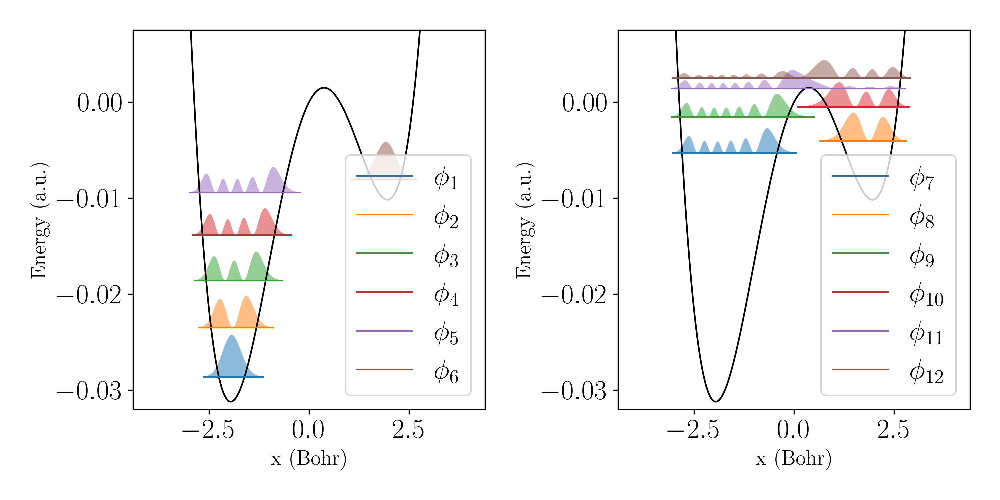
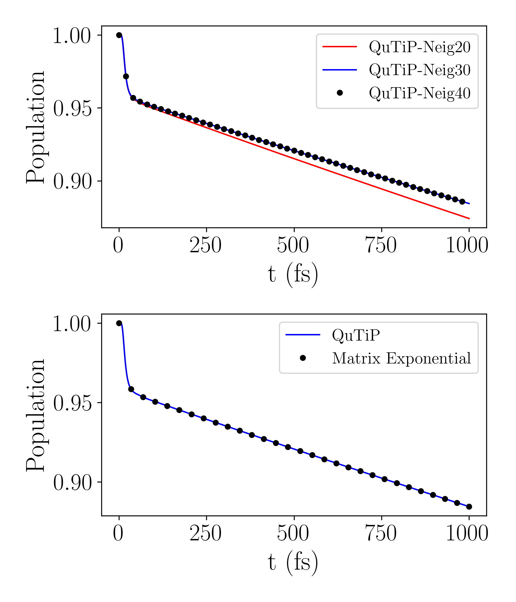
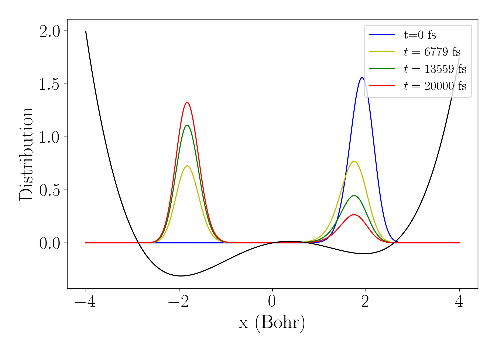
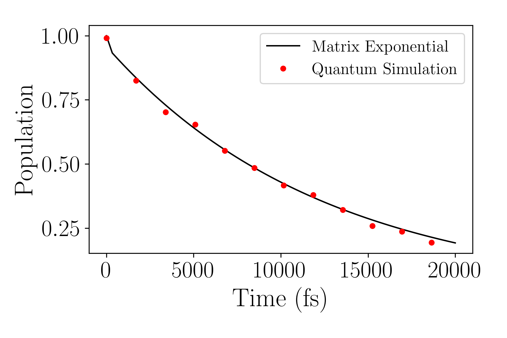

# Tutorial on quantum algorithm with the Lindblad Master Equation

Here, we provide the code for a general quantum algorithm simulating open quantum dynamics on IBM quantum Aer simulator.

## The Spin-1/2 system

### Classical simulation

```python
import qflux.open_systems.params as pa
from qflux.open_systems.numerical_methods import DynamicsOS
from qflux.open_systems.quantum_simulation import QubitDynamicsOS
import numpy as np
import matplotlib.pyplot as plt


##===========Classical Simulation
#============set the Hamiltonian and initial state
# The Spin-1/2 system Hamiltonian
Hsys = 2 * np.pi * 0.1 * pa.X

# The collapse operator and damping rate of Spin-1/2 system
gamma = 0.05
c_ops = np.sqrt(gamma)*pa.X

# Initial density matrix
rho0 = np.outer(pa.spin_up, pa.spin_up.conj())

# Time array for simulation
time_arr = np.linspace(0, (250 - 1) * 0.1, 250)

#=============instantiation
spin1_puresys = DynamicsOS(Nsys=2, Hsys=Hsys, rho0=rho0)
spin1_dissipative = DynamicsOS(Nsys=2, Hsys=Hsys, rho0=rho0, c_ops = [c_ops])

#=============propagation
# QuTiP Propagation for the pure system Liouville equation (for comparison)
expec_vals_qutip_Liouv = spin1_puresys.propagate_qt(time_arr=time_arr, observable=pa.Z)

#matrix exponential propagation
result_matrix_exp = spin1_dissipative.propagate_matrix_exp(time_arr=time_arr, observable=pa.Z)

# QuTiP Propagation for the Lindblad equation
expec_vals_qutip_Lindblad = spin1_dissipative.propagate_qt(time_arr=time_arr, observable=pa.Z)
```

We can plot the results to show agreement between matrix-vector multiplication, Lindblad propagation with QuTiP and highlight the difference between those approaches and propagation with the Liouville approach:

```python
#==============plot
plt.figure(figsize=(6,2))
plt.plot(time_arr, result_matrix_exp.expect,'b-', label = "Matrix Exponential")
plt.plot(time_arr, expec_vals_qutip_Lindblad[0],'ko',markersize=4,markevery=4, label = "QuTiP_Lindblad")
plt.plot(time_arr, expec_vals_qutip_Liouv[0],'r-', label = "QuTiP_Liouville")
plt.xlabel('time',fontsize=15)
plt.ylabel('<$\sigma^z$>(t)',fontsize=15)
plt.legend(loc = 'upper right')
plt.show()
```


### Quantum Simulation of the Spin-1/2 system: Amplitude-channel damping

```python
##================Quantum Simulation: Amplitude damping channel
# System Hamiltonian
Hsys = 0.0 * pa.I

# The collapse operator and damping rate
gamma = 1.52e9*1E-12 # the spontaneous emission rate, ps^-1
c_ops = np.sqrt(gamma)*pa.sigmap

# Initial density matrix
rho0_sdam = np.array([[1/4,1/4],[1/4,3/4]],dtype=np.complex128)

time_sdam = np.arange(0, 1000, 1) #time array, from t=0 to t=1000 ps

#=============instantiation
spin1_sdam = QubitDynamicsOS(rep='Density', Nsys=2, Hsys=Hsys, rho0=rho0_sdam, c_ops = [c_ops])
#set qubit state to measurement
spin1_sdam.set_count_str(['000','011'])
#set the dilation method, which can be 'Sz-Nagy' or 'SVD' or 'SVD-Walsh'
spin1_sdam.set_dilation_method('SVD')

#============quantum simulation
Pop_qc = spin1_sdam.qc_simulation_vecdens(time_sdam)

#compare to classical
res_sdam_classical = spin1_sdam.propagate_matrix_exp(time_sdam, observable=pa.Z, Is_store_state = True)

Pop_Mexp = np.zeros_like(Pop_qc)
for i in range(len(time_sdam)):
    Pop_Mexp[i,0] = res_sdam_classical.density_matrix[i][0,0].real
    Pop_Mexp[i,1] = res_sdam_classical.density_matrix[i][1,1].real
```

And plotting the results shows agreement with a benchmarking calculation:

```python
#============plot
plt.figure(figsize=(6,2))
plt.plot(time_sdam,Pop_qc[:,0],'r-',label="quantum,|0>")
plt.plot(time_sdam,Pop_Mexp[:,0],'ko',markersize=5,markevery=40,label="benchmark,|0>")
plt.plot(time_sdam,Pop_qc[:,1],'b-',label="quantum,|1>")
plt.plot(time_sdam,Pop_Mexp[:,1],'yo',markersize=5,markevery=40,label="benchmark,|1>")
plt.xlabel('time (ps)',fontsize=15)
plt.ylabel('$P(t)$',fontsize=15)
plt.legend(loc = 'upper right')
```


## Spin-Chain

### Set the Hamiltonian and initial state

```python
#============set the Hamiltonian and initial state
#the system Hamiltonian parameter
nsite = 3 #this states how many spins in the simulation
Nsys_sc = 2**nsite #this is the dimension of the Hilbert space
Omegai_list = [0.65, 1.0, 1.0]
Jix_list = [0.75, 1.0]
Jiy_list = [0.75, 1.0]
Jiz_list = [0.0, 0.0]

#Hamiltonian in pauli string basis
H_pauli_str = {'ZII':Omegai_list[0], 'IZI':Omegai_list[1], 'IIZ':Omegai_list[2], \
               'XXI':-0.5*Jix_list[0], 'IXX':-0.5*Jix_list[1], \
               'YYI':-0.5*Jiy_list[0], 'IYY':-0.5*Jiy_list[1], \
               'ZZI':-0.5*Jiz_list[0], 'IZZ':-0.5*Jiz_list[1]   }

#system hamiltonian
Hsys = tb.pauli_to_ham(H_pauli_str, 3)


#set up the initial state at [up,down,down...]
init_state = pa.spin_up
for i in range(nsite-1):
  init_state = np.kron(init_state,pa.spin_down)

#set up the initial density matrix according to initial state
rho0_sc = np.zeros((Nsys_sc,Nsys_sc),dtype=np.complex128)
rho0_sc += np.outer(init_state,init_state.conj())

#time array for simulation
time_arr = np.linspace(0, (250 - 1) * 0.1, 250)

#============set the collapse operator
L_sc = []
#The lindblad damping rate
Gamma1 = [0.016]*nsite
Gamma2 = [0.0523]*nsite

for isite in range(nsite):
  #Lindbladian for type 1
  res = 1.0
  for j in range(nsite):
    if(j==isite):
      res = np.kron(res,pa.sigmam)*np.sqrt(Gamma1[isite])
    else:
      res = np.kron(res,pa.I)
  L_sc.append(res)

  #Lindbladian for type 2
  res = 1.0
  for j in range(nsite):
    if(j==isite):
      res = np.kron(res,pa.sigmap@pa.sigmam)*np.sqrt(Gamma2[isite])
    else:
      res = np.kron(res,pa.I)
  L_sc.append(res)
```

### Classical Simulation


```python
##===========Classical Simulation
#=============instantiation
spin_chain_puresys =  DynamicsOS(Nsys=Nsys_sc, Hsys=Hsys, rho0=rho0_sc)
spin_chain_opensys =  DynamicsOS(Nsys=Nsys_sc, Hsys=Hsys, rho0=rho0_sc, c_ops = L_sc)

#=============propagation
# QuTiP Propagation for the pure system Liouville equation (for comparison)
result_qutip_Liouv = spin_chain_puresys.propagate_qt(time_arr=time_arr, observable=rho0_sc)

#matrix exponential propagation
result_matrix_exp = spin_chain_opensys.propagate_matrix_exp(time_arr=time_arr, observable=rho0_sc)

# QuTiP Propagation for the Lindblad equation
result_qutip_Lindblad = spin_chain_opensys.propagate_qt(time_arr=time_arr, observable=rho0_sc)

As_matrix_exp = np.sqrt(result_matrix_exp.expect[:])
As_qutip = np.sqrt(result_qutip_Lindblad[0][:])
As_qutip_liouv = np.sqrt(result_qutip_Liouv[0][:])
```

And we can plot the results:

```python
#==============plot
plt.figure(figsize=(6,2))
plt.plot(time_arr,As_matrix_exp,'b-', label="Matrix Exponential")
plt.plot(time_arr,As_qutip,'ko',markersize=4,markevery=4,label="QuTiP_Lindblad")
plt.plot(time_arr,As_qutip_liouv,'r-',label="Pure System")
plt.xlabel('time',fontsize=15)
plt.ylabel('$A_s$(t)',fontsize=15)
plt.legend(loc = 'upper right')
```


### Quantum Simulation

```python
##===========Quantum Simulation
qspin_chain = QubitDynamicsOS(rep='Density',Nsys=Nsys_sc, Hsys=Hsys, rho0=rho0_sc, c_ops = L_sc)
qspin_chain.set_count_str(['0011011'])

res_qc_1k = qspin_chain.qc_simulation_vecdens(time_arr,shots=1000)
res_qc_1w = qspin_chain.qc_simulation_vecdens(time_arr,shots=10000)

As_qc_1k = np.sqrt(res_qc_1k)
As_qc_1w = np.sqrt(res_qc_1w)
```

And we can plot the results:

```python
#==============plot
plt.figure(figsize=(6,2))
plt.plot(time_arr,As_qc_1k[:],'r-',label=f"quantum,counts={1000}")
plt.plot(time_arr,As_qc_1w[:],'b-',label=f"quantum,counts={10000}")
plt.plot(time_arr,As_qutip,'ko',markersize=4,markevery=4,label="QuTiP benchmark")
plt.xlabel('Time',fontsize=15)
plt.ylabel('$A_s$(t)',fontsize=15)
plt.legend(loc = 'upper right')
```


## The Double Well

### Setting Things Up

```python
from qflux.open_systems.numerical_methods import DVR_grid

#=============set up the double well in the grid point representation
def pot_doublewell(x, f=0.0367493, a0=0.0, a1=0.429, a2=-1.126, a3=-0.143, a4=0.563):
    # A-T pair double-well potential in Hartrees (x is in Bohr)
    xi = x/1.9592
    return f*(a0 + a1*xi + a2*xi**2 + a3*xi**3 + a4*xi**4)

mass0 = 1836.15
beta = pa.au2joule/(pa.bolz*300) #1/(kT) in a.u. units
omega = 0.00436 #the frequency associate with the right well
kappa = 1/(10/pa.au2fs)
nth = 1/(np.exp(beta*omega)-1)

dw_grid = DVR_grid(xmin = -4.0, xmax = 4.0, Ngrid = 1024, mass = mass0)

dw_grid.set_potential(pot_doublewell)
```

### Visualizing Eigenstates of the Double Well

```python
#=============The eigen_state
Neig = 50
eneg_DW,psi_DW = dw_grid.get_eig_state(Neig)
#========plot the eigenenergy and the distribution
xgrid = dw_grid.xgrid
pot_arr = dw_grid.potential

#distribution
dis = []
for i in range(Neig):
  dis.append(abs(psi_DW[:,i])**2)

x_arr1 = {}
eig_arr1 = {}
dis_plot = {}

for i in range(Neig):
  x_arr1[i]=[]
  eig_arr1[i] = []
  dis_plot[i] = []
  for j in range(len(xgrid)):
    if(abs(dis[i][j])>1E-2):
      x_arr1[i].append(xgrid[j])
      eig_arr1[i].append(eneg_DW[i])
      dis_plot[i].append(dis[i][j])
  dis_plot[i] = np.array(dis_plot[i])

#plot
plt.figure(figsize=(10, 5))
plt.subplot(121)
plt.plot(xgrid,pot_arr,'k')

const = 0.0025
for i in range(6):
  plt.plot(x_arr1[i],eig_arr1[i],label=rf'$\phi_{{{i+1}}}$')
  #plt.plot(x_arr1[i],(dis_plot[i]*const+eneg_DW[i]))
  plt.fill_between(x_arr1[i], (dis_plot[i]*const+eneg_DW[i]), eig_arr1[i],alpha=0.5)
plt.ylim((-0.032, 0.0075))
plt.xlabel('x (Bohr)',fontsize=15)
plt.ylabel('Energy (a.u.)',fontsize=15)
plt.legend(loc = 'lower right')

plt.subplot(122)
plt.plot(xgrid,pot_arr,'k')
for i in range(6,12):
  #plt.plot(x_arr1[i],(dis_plot[i]*const+eneg_DW[i]))
  plt.plot(x_arr1[i],eig_arr1[i],label=rf'$\phi_{{{i+1}}}$')
  plt.fill_between(x_arr1[i], (dis_plot[i]*const+eneg_DW[i]), eig_arr1[i],alpha=0.5)

plt.subplots_adjust(wspace=0.3)
plt.ylim((-0.032, 0.0075))
plt.xlabel('x (Bohr)',fontsize=15)
plt.ylabel('Energy (a.u.)',fontsize=15)
plt.legend(loc = 'lower right')
plt.show()
#=================
```



### Express the double well in terms of eigenstate basis

```python
#==================Express the operators in terms of eigenstate basis===========
psik_DW = np.zeros((dw_grid.Ngrid,Neig),dtype=np.complex128)
for i in range(Neig):
    psik_DW[:,i] = dw_grid.x2k_wave(psi_DW[:,i])

#hamiltonian
H_dw = np.diag(eneg_DW)

#The operator in the eigenstate
xmat_eig = tb.trans_basis_diag(dw_grid.xgrid, Neig, psi_DW)*dw_grid.dx
pmat_eig = tb.trans_basis_diag(dw_grid.kgrid, Neig, psik_DW)*dw_grid.dk

#creation/annihilation operator
amat_eig = xmat_eig.copy()*np.sqrt(mass0*omega/2)+1j*pmat_eig.copy()/np.sqrt(mass0*omega*2)
adegmat_eig = xmat_eig.copy()*np.sqrt(mass0*omega/2)-1j*pmat_eig.copy()/np.sqrt(mass0*omega*2)

#define the population on the left/right well and transform to eigen state basis
x_barrier = 0.37321768
P_R = np.heaviside(xgrid-x_barrier,1)
P_L = 1 - np.heaviside(xgrid-x_barrier,1)

P_R_eig = tb.trans_basis_diag(P_R, Neig, psi_DW)*dw_grid.dx
P_L_eig = tb.trans_basis_diag(P_L, Neig, psi_DW)*dw_grid.dx

#initial density matrix
ini_occu = np.zeros(Neig,dtype=np.complex128)
ini_occu[5] = 1.0
rho0 = np.outer(ini_occu,ini_occu.conj())
```

### Classical Simulation

```python
#==================classical simulation============================
#propogate using QuTiP
gamma1 = np.sqrt(kappa*(nth+1))
gamma2 = np.sqrt(kappa*(nth))

time_qtp = np.linspace(0,1000/pa.au2fs,20000)

# Double_Well with different eigenstates truncation
dw_eig = {}
result_qtp = {}
for N_eig_use in [20,30,40]:
    c_ops = [gamma1*amat_eig[:N_eig_use,:N_eig_use], gamma2*adegmat_eig[:N_eig_use,:N_eig_use]]
    dw_eig[N_eig_use] = DynamicsOS(Nsys = N_eig_use, Hsys = H_dw[:N_eig_use,:N_eig_use], \
                                      rho0 = rho0[:N_eig_use,:N_eig_use], c_ops = c_ops)

    obs = [P_R_eig[:N_eig_use,:N_eig_use], P_L_eig[:N_eig_use,:N_eig_use]]
    result_qtp[N_eig_use] = dw_eig[N_eig_use].propagate_qt(time_qtp, obs, progress_bar=True)
```

```python
#this section will approximate take 10 minutes
#propagate using matrix exponential propagation
N_eig_use=30
c_ops = [gamma1*amat_eig[:N_eig_use,:N_eig_use], gamma2*adegmat_eig[:N_eig_use,:N_eig_use]]
observable = P_R_eig[:N_eig_use,:N_eig_use]

time_short = np.linspace(0,1000/pa.au2fs,30) #compare to QuTiP time scale
result_s = dw_eig[N_eig_use].propagate_matrix_exp(time_short, observable, Is_show_step=True)

time_long = np.linspace(0,20000/pa.au2fs,60) #long time propagation
result_dw_l = dw_eig[N_eig_use].propagate_matrix_exp(time_long, observable, \
                                Is_store_state = True, Is_show_step=True, Is_Gt=True)

```

And we can plot the populations for our classical simulation results:

```python
#======================plot the classical results======================
fig, axs = plt.subplots(2, 1, figsize=(6, 7))
axs[0].plot(time_qtp*pa.au2fs,result_qtp[20][0],'r-',label = 'QuTiP-Neig20')
axs[0].plot(time_qtp*pa.au2fs,result_qtp[30][0],'b-',label = 'QuTiP-Neig30')
axs[0].plot(time_qtp*pa.au2fs,result_qtp[40][0],'ko',markersize=4,markevery=400,label = 'QuTiP-Neig40')
axs[0].set_xlabel('t (fs)',fontsize=15)
axs[0].set_ylabel('Population',fontsize=15)
axs[0].legend(loc = 'upper right')

#plt.figure(figsize=(6,3))
axs[1].plot(time_qtp*pa.au2fs,result_qtp[30][0],'b-',label = 'QuTiP')
axs[1].plot(time_short*pa.au2fs,result_s.expect[:],'ko',label = 'Matrix Exponential')
axs[1].set_xlabel('t (fs)',fontsize=15)
axs[1].set_ylabel('Population',fontsize=15)
axs[1].legend(loc = 'upper right')

plt.tight_layout()
```



We can also plot the distribution over time:

```python
#plot the distribution
plt.plot(xgrid,dis_list[0],'b',label='t=0 fs')
plt.plot(xgrid,dis_list[1],'y',label=rf'$t={{{int(time_long[20]*pa.au2fs)}}}$ fs')
plt.plot(xgrid,dis_list[2],'g',label=rf'$t={{{int(time_long[40]*pa.au2fs)}}}$ fs')
plt.plot(xgrid,dis_list[3],'r',label=rf'$t={{{int(time_long[59]*pa.au2fs)}}}$ fs')
plt.plot(xgrid,pot_arr*10,'k')
plt.xlabel('x (Bohr)',fontsize=15)
plt.ylabel('distribution',fontsize=15)
plt.legend(loc = 'upper right')
plt.show()
```



### Quantum Simulation

```python
from qflux.open_systems.quantum_simulation import expand

##===============Quantum Simulation ====================================
dim_dw = 32

# initial state of the double-well in the dilated space
ini_occu = np.zeros(dim_dw,dtype=np.complex128)
ini_occu[5] = 1.0
rho0 = np.outer(ini_occu,ini_occu.conj())

#hamiltonian
Hsys = H_dw[:dim_dw,:dim_dw]

#collapse operator and observable
c_ops = [gamma1*amat_eig[:dim_dw,:dim_dw], gamma2*adegmat_eig[:dim_dw,:dim_dw]]
observable = P_R_eig[:dim_dw,:dim_dw]

#extract the propagator from result of classical simulation,
#and expand to match the dimension of qubit space
#For saving calculation, only choose some time points
ilarge = 5
nsteps = int(len(time_long)/ilarge)
time_qdw = np.zeros(nsteps)
Gprop_dw = []

for i0 in range(nsteps):
    i = i0*ilarge
    org_dim = result_dw_l.density_matrix[i].shape[0]
    Gprop_dw.append(expand(result_dw_l.Gprop[i],org_dim,dim_dw))

    time_qdw[i0] = time_long[i]

#double well instance
dw_quantum = QubitDynamicsOS(rep='Kraus', Nsys=dim_dw, Hsys=Hsys, rho0=rho0, c_ops = c_ops)
dw_quantum.set_observable(observable)

#running the quantum simulation
P_dw_qc = dw_quantum.qc_simulation_kraus(time_qdw, shots=2000,  Gprop = Gprop_dw, tolk = 1E-2, tolo = 5E-3)
```

We can then plot the results:

```python
#=================plot=========================
plt.figure(figsize=(6,3))
plt.plot(time_long*pa.au2fs,result_dw_l.expect,'k-',label = 'Matrix Exponential')
plt.plot(time_qdw*pa.au2fs,P_dw_qc,'ro',label = 'quantum simulation')
plt.xlabel('t (fs)',fontsize=15)
plt.ylabel('Population',fontsize=15)
plt.legend(loc = 'upper right')
plt.show()
```



