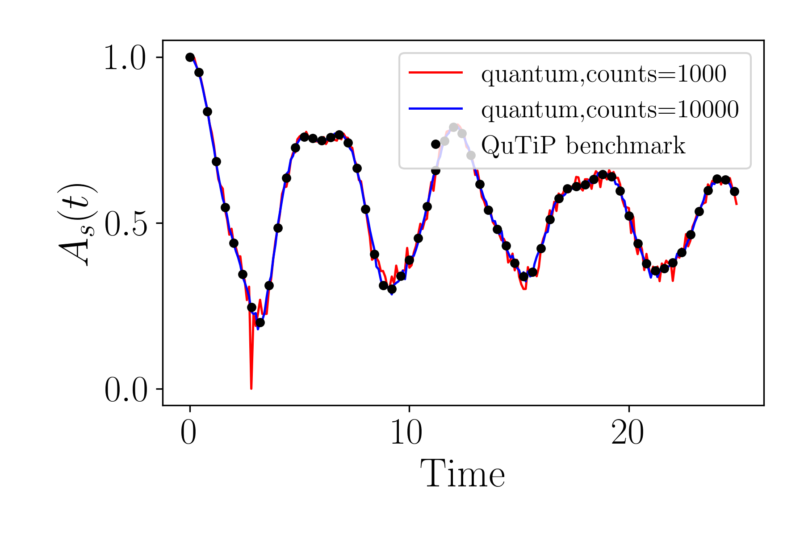

# Open Quantum Dynamics of a Spin Chain

This documentation describes how to simulate the open quantum dynamics of a spin chain using the Lindbladian formalism. The simulation supports both classical and quantum computation backends and showcases comparison plots between different solver strategies.

---

## System Setup

<figure markdown="span">
![Schematic representation of a spin chain model coupled to an environment, where a graphene nanoribbon acts as a spin chain. The free radical moieties in the polymer group (red or blue molecular groups in the figure) represent the spin sites, which may have spin up or down.  Omega is the energy required to flip the spin state at the particular polymer site n, and J is the offsite couplings between adjacent spins. The graphene nanoribbon is coupled to a bath, with the dissipation effect given by the damping rate gamma](../images/Part_II/Lindbladian_radicals.png){: width="800"}
</figure>

We begin by specifying the system Hamiltonian and initial state for a chain of $n = 3$ spins, with the form

$$  H = \sum_{n=0}^{N-1} \Omega_{n} \sigma_{n}^{z} - \frac{1}{2} \sum_{n=0}^{N-2} ( J_{n,n+1}^{x} \sigma_{n}^{x} \sigma_{n+1}^{x} + J_{n,n+1}^{y} \sigma_{n}^{y} \sigma_{n+1}^{y} + J_{n,n+1}^{z} \sigma_{n}^{z} \sigma_{n+1}^{z} ) $$

The Hamiltonian is defined using a Pauli string representation and includes local $Z$-field terms and $XX$, $YY$, and $ZZ$ couplings, with coefficients given according to the table:

| Parameter             |  $n = 0$    |  $n \neq 0$    |
|-----------------------|-------------|----------------|
|  $\Omega_n$           | 0.65        | 1.0            |
|  $J_{n,n+1}^{x}$      | 0.75        | 1.0            |
|  $J_{n,n+1}^{y}$      | 0.75        | 1.0            |
|  $J_{n,n+1}^{z}$      | 0.0         | 0.0            |

```python
import numpy as np
import matplotlib.pyplot as plt

import qflux.open_systems.params as pa
from qflux.open_systems.numerical_methods import DynamicsOS
from qflux.open_systems.quantum_simulation import QubitDynamicsOS
import qflux.open_systems.trans_basis as tb


# Set the Hamiltonian and Initial State
# System Hamiltonian Parameters
nsite = 3 # this sets how many spins in the simulation
Nsys_sc = 2**nsite # this is the dimension of the Hilbert space
Omegai_list = [0.65, 1.0, 1.0]
Jix_list = [0.75, 1.0]
Jiy_list = [0.75, 1.0]
Jiz_list = [0.0, 0.0]

# Hamiltonian in pauli string basis
H_pauli_str = {'ZII':Omegai_list[0], 'IZI':Omegai_list[1], 'IIZ':Omegai_list[2], \
               'XXI':-0.5*Jix_list[0], 'IXX':-0.5*Jix_list[1], \
               'YYI':-0.5*Jiy_list[0], 'IYY':-0.5*Jiy_list[1], \
               'ZZI':-0.5*Jiz_list[0], 'IZZ':-0.5*Jiz_list[1]   }

# System Hamiltonian
Hsys = tb.pauli_to_ham(H_pauli_str, 3)
```

The initial state is constructed as a product state $|\uparrow\downarrow\downarrow\cdots\rangle$, and its corresponding density matrix is stored in `rho0_sc`. The time evolution will be simulated over a grid defined in `time_arr`.


```python
# Set up the initial state at [up,down,down...]
init_state = pa.spin_up
for i in range(nsite-1):
  init_state = np.kron(init_state,pa.spin_down)

# Set up the initial density matrix according to initial state
rho0_sc = np.zeros((Nsys_sc,Nsys_sc),dtype=np.complex128)
rho0_sc += np.outer(init_state,init_state.conj())

# Time array for simulation
time_arr = np.linspace(0, (250 - 1) * 0.1, 250)
```

---

## Collapse Operators (Lindblad Dissipators)

Open quantum dynamics are modeled using the Lindblad master equation.

$$ \dot{\rho}(t) = -i [H, \rho(t)] + \frac{1}{2} \sum_{m=1}^{2} \sum_{n=0}^{N-1} \gamma_{m,n} \left[ 2 L_{m,n} \rho(t) L_{m,n}^{\dagger} - \rho(t) L_{m,n}^{\dagger} L_{m,n} - L_{m,n}^{\dagger} L_{m,n} \rho(t) \right] $$

Here we construct collapse operators $L_i$ representing two types of dissipation:

- Type 1: Amplitude damping via $\sigma^-$
- Type 2: Dephasing via $\sigma^+ \sigma^-$

These are weighted by decay rates $\Gamma_1$ and $\Gamma_2$ per site.

```python
L_sc = []
# The lindblad damping rate
Gamma1 = [0.016]*nsite
Gamma2 = [0.0523]*nsite

for isite in range(nsite):
  # Lindbladian for type 1
  res = 1.0
  for j in range(nsite):
    if(j==isite):
      res = np.kron(res,pa.sigmam)*np.sqrt(Gamma1[isite])
    else:
      res = np.kron(res,pa.I)
  L_sc.append(res)

  # Lindbladian for type 2
  res = 1.0
  for j in range(nsite):
    if(j==isite):
      res = np.kron(res,pa.sigmap@pa.sigmam)*np.sqrt(Gamma2[isite])
    else:
      res = np.kron(res,pa.I)
  L_sc.append(res)
```

Each collapse operator is built as a Kronecker product over the sites, selectively applying the operator at the target site and identities elsewhere.

---

## Classical Simulation

We now instantiate the system using both pure and open dynamics objects:

- `DynamicsOS` for simulating Liouville and Lindblad evolution
- Propagation methods:
  - `propagate_qt`: Uses QuTiP for integration
  - `propagate_matrix_exp`: Uses matrix exponentials

```python
# Instantiation
spin_chain_puresys =  DynamicsOS(Nsys=Nsys_sc, Hsys=Hsys, rho0=rho0_sc)
spin_chain_opensys =  DynamicsOS(Nsys=Nsys_sc, Hsys=Hsys, rho0=rho0_sc, c_ops = L_sc)

# Propagation
# QuTiP Propagation for the pure system Liouville equation (for comparison)
result_qutip_Liouv = spin_chain_puresys.propagate_qt(time_arr=time_arr, observable=rho0_sc)

# Matrix exponential propagation
result_matrix_exp = spin_chain_opensys.propagate_matrix_exp(time_arr=time_arr, observable=rho0_sc)

# QuTiP Propagation for the Lindblad equation
result_qutip_Lindblad = spin_chain_opensys.propagate_qt(time_arr=time_arr, observable=rho0_sc)

As_matrix_exp = np.sqrt(result_matrix_exp.expect[:])
As_qutip = np.sqrt(result_qutip_Lindblad[0][:])
As_qutip_liouv = np.sqrt(result_qutip_Liouv[0][:])
```

The results `As_matrix_exp`, `As_qutip`, and `As_qutip_liouv` represent expectation values (e.g., fidelity or survival amplitude) computed using each method.

---

## Plotting Classical Results

We visualize the classical simulations by plotting the observable $A_s(t) = \sqrt{\langle \rho_0 | \rho(t) \rangle}$.

```python
plt.figure(figsize=(6,2))
plt.plot(time_arr,As_matrix_exp,'b-', label="Matrix Exponential")
plt.plot(time_arr,As_qutip,'ko',markersize=4,markevery=4,label="QuTiP_Lindblad")
plt.plot(time_arr,As_qutip_liouv,'r-',label="Pure System")
plt.xlabel('time',fontsize=15)
plt.ylabel('$A_s$(t)',fontsize=15)
plt.legend(loc = 'upper right')
```

The comparison between matrix exponential, QuTiP Lindblad, and pure unitary evolution offers a benchmark for accuracy and computational cost.

<figure markdown="span">
{: width="800"}
</figure>

---

## Quantum Simulation

A quantum simulation backend is invoked using the `QubitDynamicsOS` class. This assumes density matrix simulation via vectorization and allows control over measurement configuration and shot noise.

```python
qspin_chain = QubitDynamicsOS(rep='Density',Nsys=Nsys_sc, Hsys=Hsys, rho0=rho0_sc, c_ops = L_sc)
qspin_chain.set_count_str(['0011011'])

res_qc_1k = qspin_chain.qc_simulation_vecdens(time_arr,shots=1000)
res_qc_1w = qspin_chain.qc_simulation_vecdens(time_arr,shots=10000)

As_qc_1k = np.sqrt(res_qc_1k['data'])
As_qc_1w = np.sqrt(res_qc_1w['data'])
```

The `set_count_str` method defines which measurement outcomes to track, and `qc_simulation_vecdens` performs the evolution using a quantum processor or simulator.

---

## Plotting Quantum Results

We compare quantum results (with different shot counts) against the classical QuTiP benchmark. Increasing shot count reduces statistical noise.

```python
plt.figure(figsize=(6,2))
plt.plot(time_arr,As_qc_1k,'r-',label=f"quantum,counts={1000}")
plt.plot(time_arr,As_qc_1w,'b-',label=f"quantum,counts={10000}")
plt.plot(time_arr,As_qutip,'ko',markersize=4,markevery=4,label="QuTiP benchmark")
plt.xlabel('Time',fontsize=15)
plt.ylabel('$A_s$(t)',fontsize=15)
plt.legend(loc = 'upper right')
```

This plot illustrates convergence of quantum simulation with classical reference as the number of measurement shots increases.

<figure markdown="span">
{: width="800"}
</figure>

---

## Summary

This example presents a flexible simulation pipeline for open quantum systems, written in a basis of Pauli strings:

- Supports classical (QuTiP, matrix exponential) and quantum (density matrix) backends
- Compares open vs. closed evolution
- Allows benchmarking between solver strategies

The use of Lindbladian formalism and collapse operators enables modeling dissipative processes essential for realistic simulations of physical processes.
