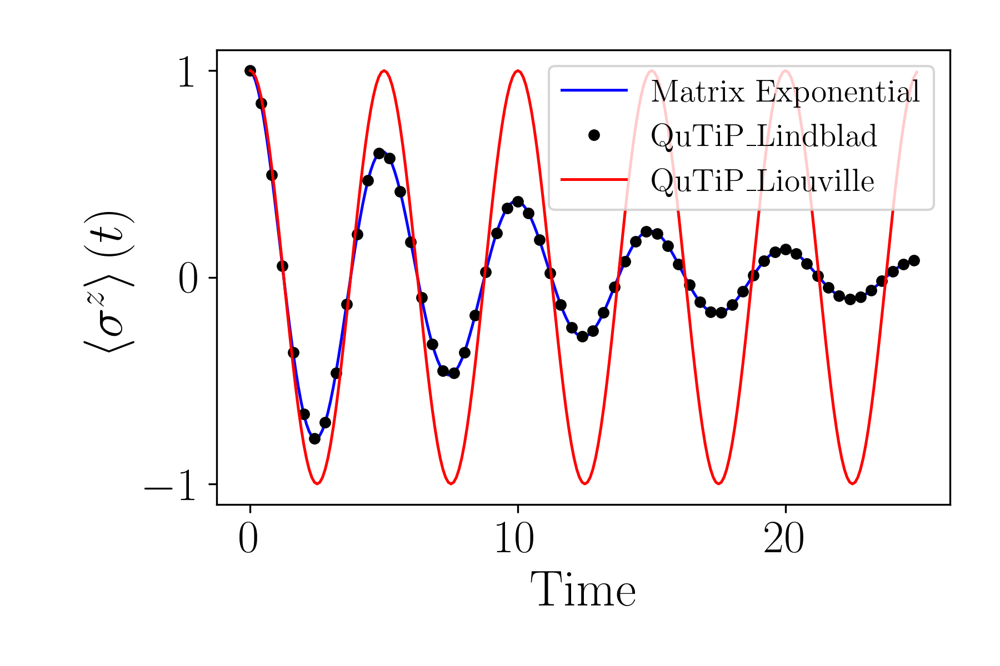

# The Spin-1/2 System

This section illustrates the simulation of an open quantum Spin-1/2 system using both classical and quantum backends, implemented within QFlux. The system features amplitude damping, and comparisons are made between numerical methods to validate the implementation.

---

## Classical Simulation

We begin by setting up the classical evolution of a Spin-1/2 system governed by a simple Hamiltonian and subject to dissipation via a collapse operator. The system's evolution is computed using both matrix exponentiation and QuTiP solvers for benchmarking.

```python
import qflux.open_systems.params as pa
from qflux.open_systems.numerical_methods import DynamicsOS
from qflux.open_systems.quantum_simulation import QubitDynamicsOS
import numpy as np
import matplotlib.pyplot as plt
```

The Hamiltonian is chosen to be proportional to the Pauli-X matrix:

$$
H_{\text{sys}} = 2\pi \times 0.1 \cdot \sigma^x
$$

and the collapse operator introduces dephasing:

$$
C = \sqrt{\gamma} \cdot \sigma^x, \quad \gamma = 0.05
$$

The initial state is the pure spin-up state along the z-axis:

$$
\rho_0 = |\uparrow\rangle\langle\uparrow|
$$

```python
Hsys = 2 * np.pi * 0.1 * pa.X
gamma = 0.05
c_ops = np.sqrt(gamma)*pa.X
rho0 = np.outer(pa.spin_up, pa.spin_up.conj())
time_arr = np.linspace(0, (250 - 1) * 0.1, 250)

spin1_puresys = DynamicsOS(Nsys=2, Hsys=Hsys, rho0=rho0)
spin1_dissipative = DynamicsOS(Nsys=2, Hsys=Hsys, rho0=rho0, c_ops = [c_ops])

expec_vals_qutip_Liouv = spin1_puresys.propagate_qt(time_arr=time_arr, observable=pa.Z)
result_matrix_exp = spin1_dissipative.propagate_matrix_exp(time_arr=time_arr, observable=pa.Z)
expec_vals_qutip_Lindblad = spin1_dissipative.propagate_qt(time_arr=time_arr, observable=pa.Z)
```

We now compare the results obtained from matrix exponential evolution, QuTiP Lindblad dynamics, and the pure Liouville evolution. The close agreement validates the numerical implementation.

```python
plt.figure(figsize=(6,2))
plt.plot(time_arr, result_matrix_exp.expect,'b-', label = "Matrix Exponential")
plt.plot(time_arr, expec_vals_qutip_Lindblad[0],'ko',markersize=4,markevery=4, label = "QuTiP_Lindblad")
plt.plot(time_arr, expec_vals_qutip_Liouv[0],'r-', label = "QuTiP_Liouville")
plt.xlabel('time',fontsize=15)
plt.ylabel('<$\sigma^z$>(t)',fontsize=15)
plt.legend(loc = 'upper right')
plt.show()
```



---

## Quantum Simulation of the Spin-1/2 System: Amplitude-Channel Damping

We next examine quantum simulation of amplitude damping, using a zero Hamiltonian:

$$
H_{\text{sys}} = 0
$$

and a collapse operator proportional to the spin-raising operator:

$$
C = \sqrt{\gamma} \cdot \sigma^+
$$

with

$$
\gamma = 1.52 \times 10^9 \text{ ps}^{-1} \times 10^{-12}
$$

The system is initialized in a mixed state:

$$
\rho_0 = \begin{bmatrix} 1/4 & 1/4 \\ 1/4 & 3/4 \end{bmatrix}
$$

```python
Hsys = 0.0 * pa.I
gamma = 1.52e9*1E-12
c_ops = np.sqrt(gamma)*pa.sigmap
rho0_sdam = np.array([[1/4,1/4],[1/4,3/4]],dtype=np.complex128)
time_sdam = np.arange(0, 1000, 1)
```

We instantiate the quantum simulation with `QubitDynamicsOS`, specifying the dilation method and target measurement strings:

```python
spin1_sdam = QubitDynamicsOS(rep='Density', Nsys=2, Hsys=Hsys, rho0=rho0_sdam, c_ops = [c_ops])
spin1_sdam.set_count_str(['000','011'])
spin1_sdam.set_dilation_method('SVD')
```

The simulation is run using the quantum backend, and results are benchmarked against a classical matrix exponentiation method.

```python
Pop_qc = spin1_sdam.qc_simulation_vecdens(time_sdam)
res_sdam_classical = spin1_sdam.propagate_matrix_exp(time_sdam, observable=pa.Z, Is_store_state = True)

Pop_Mexp = np.zeros_like(Pop_qc)
for i in range(len(time_sdam)):
    Pop_Mexp[i,0] = res_sdam_classical.density_matrix[i][0,0].real
    Pop_Mexp[i,1] = res_sdam_classical.density_matrix[i][1,1].real
```

The population dynamics of both the excited and ground states are plotted, showing excellent agreement:

```python
plt.figure(figsize=(6,2))
plt.plot(time_sdam,Pop_qc[:,0],'r-',label="quantum,|0>")
plt.plot(time_sdam,Pop_Mexp[:,0],'ko',markersize=5,markevery=40,label="benchmark,|0>")
plt.plot(time_sdam,Pop_qc[:,1],'b-',label="quantum,|1>")
plt.plot(time_sdam,Pop_Mexp[:,1],'yo',markersize=5,markevery=40,label="benchmark,|1>")
plt.xlabel('time (ps)',fontsize=15)
plt.ylabel('$P(t)$',fontsize=15)
plt.legend(loc = 'upper right')
```


## Summary

In this tutorial, we explored both classical and quantum simulations of a spin-1/2 (two-level) open quantum system using QFlux, with emphasis on amplitude damping dynamics. Key points include:

- Understanding how to define a Hamiltonian and collapse operators for open quantum systems using Lindblad formalism.
- Implementing classical propagation methods such as matrix exponentials and QuTiP-based solvers to simulate dissipative dynamics.
- Comparing classical Liouville and Lindblad evolution approaches and interpreting their differences in population dynamics.
- Executing quantum simulations using qubit-based models, including custom dilation strategies (e.g., SVD) for simulating quantum channels.
- Benchmarking quantum simulation results against classical matrix-exponential methods to validate accuracy.

These techniques lay the foundation for simulating more complex quantum systems and provide practical tools for studying open-system dynamics in both research and quantum hardware contexts.
