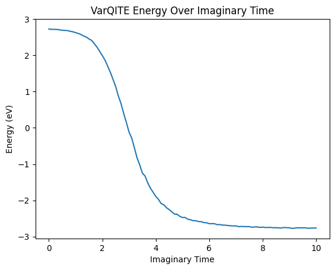
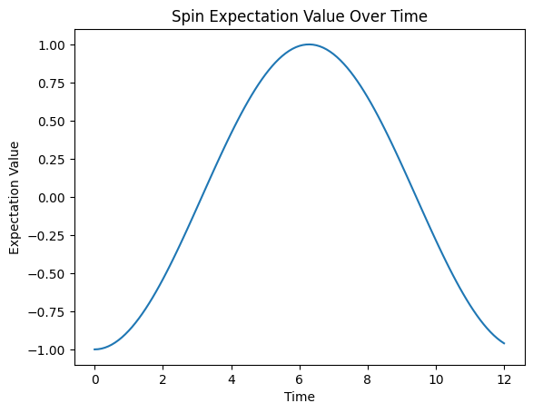

# **Variational Quantum Time Evolution (VarQTE)**

## Motivation

The **VarQTE module** provides tools to simulate quantum processes through two complementary approaches:

* **Variational Quantum Imaginary Time Evolution (VarQITE)**
* **Variational Quantum Real Time Evolution (VarQRTE)**

Both methods allow the user to approximate observables of a quantum system by updating the parameters of a parameterized ansatz circuit.

Protocol for using VarQTE in practice:

1. **Construct the problem Hamiltonian** as a `qiskit.SparsePauliOp` object
2. **Construct the initial state** as a `qiskit.QuantumCircuit`
3. **Run VarQITE or VarQRTE** with the desired hyperparameters (layers, total time, timestep)
4. **Obtain ansatz parameters** at each timestep
5. **Measure observables**, either:

   * directly with the `ansatz_energy` function (for energy), or
   * by constructing the ansatz circuit with `Construct_Ansatz` (for custom observables).

VarQITE and VarQRTE both employ a **TwoLocal ansatz**, returning the optimal parameter values at each timestep, which can then be analyzed to study system properties.

---

## Import Dependencies

```python
!pip install qflux
```

```python
import matplotlib.pyplot as plt
from qiskit import QuantumCircuit
from qiskit.quantum_info import SparsePauliOp

from qflux.closed_systems.VarQTE import VarQITE, VarQRTE, ansatz_energy, Construct_Ansatz
```

---

## Variational Quantum Imaginary Time Evolution (VarQITE)

We begin with the **Wick-rotated Schrödinger equation** and apply McLachlan’s Variational Principle:

$$
\delta \bigg\lVert \Big(\frac{d}{d\tau} + \mathcal{H} - E_{\tau}\Big)\left|{\psi(\tau)}\right\rangle \bigg\rVert = 0
$$

For a parameterized ansatz state,

$$
\left|{\psi(\tau)}\right\rangle = \left|{\psi(\theta(\tau))}\right\rangle
$$

this leads to a system of linear equations:

$$
\sum_j A_{ij} \dot\theta_j = C_i
$$

where

$$
    A_{ij} = \Re\Bigg(\frac{\partial\left\langle{\phi(\theta(\tau))}\right|}{\partial\theta_i}\frac{\partial\left|{\phi(\theta(\tau))}\right\rangle}{\partial\theta_j}\Bigg),
$$

$$
    C_i = - \Re\Bigg(\left\langle{\tfrac{\partial\phi(\theta(\tau))}{\partial\theta_i}}\right|\mathcal{H}\left|{\phi(\theta(\tau))}\right\rangle\Bigg).
$$

These \$A\_{ij}\$ and \$C\_i\$ values are measured on a quantum device and used to update ansatz parameters:

$$
\theta(\tau + d\tau) = \theta(\tau) + \dot\theta\, d\tau.
$$

The derivatives of the quantum state with respect to the variational parameters are linked to the generators $G_i$ of the ansatz:

$$
    \dfrac{\partial\ket{\psi(\theta(t))}}{\partial\theta_i} = -\ii G_i\ket{\psi(\theta(t))}.
$$

For instance, in the case of a single qubit $Z$-rotation,

$$
    \dfrac{\partial}{\partial\theta} e^{-\ii\theta\sigma_Z}\ket{\psi} = -\ii\sigma_Ze^{-\ii\theta\sigma_Z}\ket{\psi}
$$

Therefore, one can evaluate the expectation values introduced by the $A_{ij}, C_{i}$ by performing Hadamard tests on the corresponding generators of the ansatz.

For example, to determine the elements of the matrix $A_{ij}$, the dagger of the generator of parameter i ($G_i^\dagger$) and the parameter of generator j ($G_j$) must be measured using the same ancilla qubit.  This can be done by initializing the ancilla qubit to the $\ket{0}$ state, and performing a pair of not-gates on the ancilla qubits before and after measuring $G_i$ to measure $G_i^\dagger$, and subsequently measuring $G_i$ with a Hadamard test using the same ancilla.

Reference implementations of this algorithm are used below, using QFlux to simulate the imaginary-time evolution spin-systems. The simulations apply the McLachlan variational principle through the `VarQRTE` function, demonstrating how variational techniques can efficiently capture quantum dynamics within shallow, noise-resilient circuits.

---

### Demonstrations

#### Example 1: Simple Hamiltonian

Focusing on a simple Hamiltonian, consisting of a spin chain defined by the Pauli-Z matrix, we setup the initial state using a qiskit QuantumCircuit and the hyperparameters for VarQITE, such as number of layers in the ansatz, the timestep and total simulation time.
Finally, we call VarQITE to run the time evolution and output the ansatz parameter values.


```python
# Define the problem Hamiltonian
H = SparsePauliOp.from_list([("Z", 1.0)])

# Set up the initial state
qc = QuantumCircuit(3)

# Hyperparameters for VarQITE
layers = 0
total_time = 10
timestep = 0.1

# Run VarQITE
params = VarQITE(layers, H, total_time, timestep, init_circ=qc)
```

Furethermore, we can use the parameters to measure observables with a quantum circuit:

```python
# Measure energy at a given timestep
my_energy, my_stdev = ansatz_energy(qc, params[i], H)

# Measure a custom observable
observable = SparsePauliOp.from_list([("Z", 1.0)])
ansatz = Construct_Ansatz(qc, params[i], H.num_qubits)
result = estimator.run(ansatz, observables=observable).result()
```

#### Example 2: Hamiltonian with couplings

Similarly, we can apply this protocol for a more sophisticated Hamiltonian, containing couplings between different sites:

```python
H = SparsePauliOp.from_list([
    ("IIZ", 1.0), ("IZI", 1.0), ("ZII", 0.65),
    ("IXX", 1.0), ("IYY", 1.0),
    ("XXI", 0.75), ("YYI", 0.75)
])
```

**Initial state and execution:**

```python
qc = QuantumCircuit(3)
qc.rx(0.5, 0)
qc.rx(0.5, 1)
qc.rx(0.5, 2)

params = VarQITE(layers, H, total_time, timestep, init_circ=qc)
```

`params` now holds the parameter values for the ansatz at each timestep for Imaginary-Time Evolution

**Plotting the dynamics:**

```python
all_energies = []
for i in range(len(params)):
    print(f"Timestep {i} Energy: {ansatz_energy(qc, params[i], H)}")
    all_energies.append(ansatz_energy(qc, params[i], H)[0])

plt.title("VarQITE Energy Over Imaginary Time")
plt.plot([i*timestep for i in range(int(total_time/timestep)+1)], all_energies)
plt.xlabel("Imaginary Time")
plt.ylabel("Energy (eV)")
plt.show()
```



**Interpretation:**
VarQITE drives the system toward the **ground state** as imaginary time increases, provided the ansatz is expressive enough. This enables estimation of the ground-state energy by sampling the long-time behavior.

---

## Variational Quantum Real Time Evolution (VarQRTE)

Analogous to the problem of finding eigenstates of a Hamiltonian is the problem of dynamics, which can be also be approached with the Variational Quantum Real-Time Evolution (VarQRTE).

We now consider **real-time dynamics** by starting with the Schrödinger equation and applying McLachlan’s Variational Principle:

$$
    \delta \left\Vert\left(\frac{\partial}{\partial t} + i\mathcal{H}\right)\ket{\psi(\theta(t))}\right\Vert = 0.
$$

The starting state can be evolved through real time in a variational form vary similar to VarQITE, except with one change when calculating the elements of $C_i$,

$$
    C_i = - \Im\Bigg(\left\langle{\tfrac{\partial\phi(\theta(t))}{\partial\theta_i}}\right| \mathcal{H}\left|{\phi(\theta(t))}\right\rangle\Bigg).
$$

Building upon the same framework as VarQITE, one can measure the $A_{ij}$ and $C_i$ matrices on a quantum computer, and use them to change the parameters $\theta(t+dt) = \theta(t)+\dot\theta dt$.

Within QFlux, `VarQRTE` reuses the same modular components while invoking `Measure_C` with `evolution_type="imaginary"`. This structural parallel highlights how both real- and imaginary-time algorithms are implemented through identical circuit primitives.

---

### Demonstration

We proceed by defining the Hamiltonian and initial state, along with instantiating the VarQRTE class with appropriate hyper-parameters.

```python
H = SparsePauliOp.from_list([("X", 1.0)])
qc = QuantumCircuit(1)
qc.x(0)  # Prepare |1> state

layers = 1
total_time = 12
timestep = 0.1

params = VarQRTE(layers, H, total_time, timestep, init_circ=qc)
```

We can measure observables over time using an Estimator object, supplied with the optimized circuit parameters and the observable circuit.

```python
from qiskit.primitives import Estimator

estimator = Estimator()
observable = SparsePauliOp.from_list([("Z", 1.0)])
spin_values = []

for i in range(len(params)):
    ansatz = Construct_Ansatz(qc, params[i], H.num_qubits)
    result = estimator.run(ansatz, observables=observable).result()
    spin_values.append(result.values[0])

plt.title("Spin Expectation Value Over Time")
plt.plot([i*timestep for i in range(int(total_time/timestep)+1)], spin_values)
plt.xlabel("Time")
plt.ylabel("Expectation Value")
plt.show()
```



**Interpretation:**
VarQRTE captures the change in state of quantum systems in real-time. As seen in the example, the expectation value of spin follows the expected sinusoidal pattern of coherent quantum evolution.
